
<h1>Calculus Solution</h1>

<h3>Content</h3>

[TOC]

# Chapter 1 Functions

## 1.1 Common Functions

**Function**

Some types of functions: linear, parabolas, ...

The domain of a function $ f $ is the set of all valid input values. The range consists of the set of all output values that can be reached using those domain values.

**Rational Function**

basic form: $ y = {1 \over x} $

vertical asymptote at $ x = 0 $

horizontal asymptote at $ y = 0 $

**Root Function**

basic form: $ y = \sqrt[n]{x} $

$ n $ even: undefined when the root is negative

$ n $ odd: $ x \in \mathbb{R} $

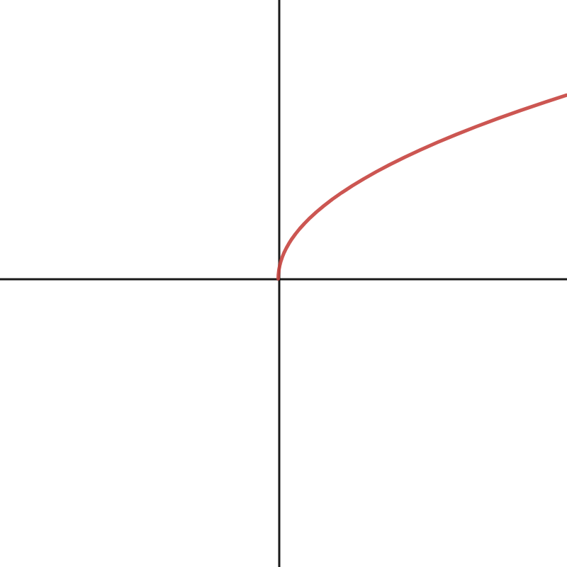

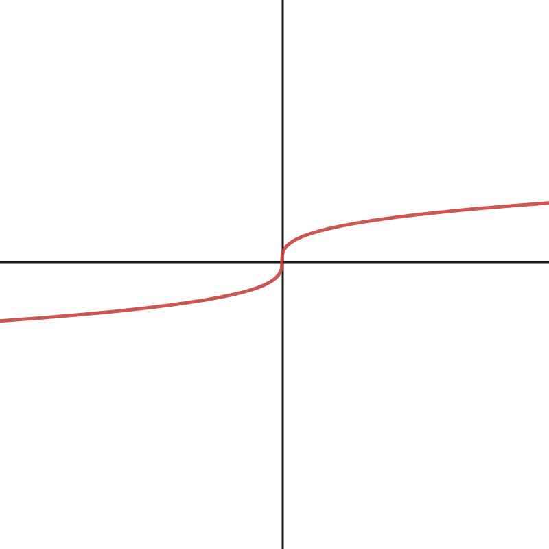

**Higher-degree of Polynomial Function**

basic form: $ y = x^n $

domain: $ x \in \mathbb{R} $

$ n $ even: both ends of the function tend to $ +\infin $ or both tend to $ -\infin $

$ n $ odd: one end tends to $ +\infin $ while the other tends to $ -\infin $

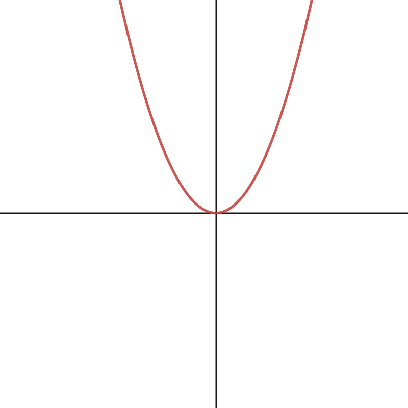

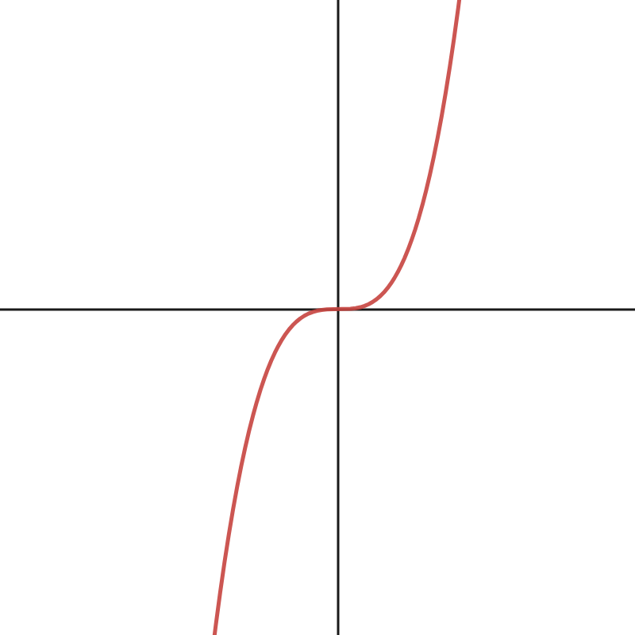

 

## 1.2 Angles, Degrees, and Radians

**Angle**

An angle is created by two rays that intersect at a common endpoint. We use Greek letter $ \theta $ to denote angles.

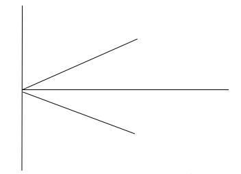

An angle that opens counterclockwise from the x-axis is positive.

An angle that opens clockwise from the x-axis is negative.

**Degree / Radian**

Angles can be measured in 2 ways:

1. A degree is a measure of the angle formed by $ 1 \over 360 $ of one complete rotation of a circle.
2. A radian is a measure of the angle formed by the arc of a circle whose length is equal to the circle’s radius.

$$
\theta = {s \over r} = {arclength \over radius}
$$

How are radians and degrees related?

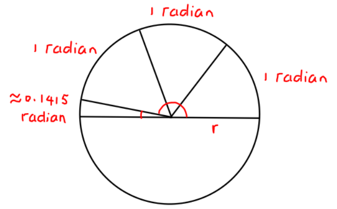
$$
180\degree = \pi \ radians \\
1\degree = {\pi \over 180} \ radians \\
1 \ radian = {180 \over \pi}\degree
$$
This relationship provides us with a way to easily convert between the two measures.

---

【Example】Convert from degrees to radians.

(a) $ 30\degree = {\pi \over 180}(30) = {\pi \over 6} $

(b) $ 220\degree = {\pi \over 180}(220) = {11\pi \over 9} $

【Example】Convert from radians to degrees.

(a) $ {\pi \over 4} = {180\degree \over \pi} = 45\degree  $

(b) $ {5\pi \over 6} = {5 \over 6} \cdot 180\degree = 150\degree $ 

---

Given any angle $ \theta $, what are these equivalent angles?
$$
\theta + 2k\pi \ (k \in \mathbb{Z})
$$

 

 ## 1.3 Trigonometric Functions

**Trigonometric Functions**

Let O be the origin and $ P(x, y) $ be a point on the unit circle so that the radius $ OP $ forms an angle of $ \theta $ radians with respect to the positive x-axis.

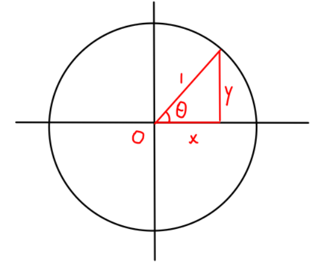
$$
x = cos(\theta) \\
y = sin(\theta)
$$
Here are the three most common trigonometric functions and their reciprocals.

| $ sin(\theta) = y $      |  |
| ------------------------ | :---------------------------------------------------------: |
| domain                   |                  $ \theta \in \mathbb{R} $                  |
| range                    |                $ -1 \le sin(\theta) \le 1 $                 |
| $ sin(\theta) = 0 $ when |             $ \theta = k\pi, k \in \mathbb{Z} $             |

| $ cos(\theta) = x $      | 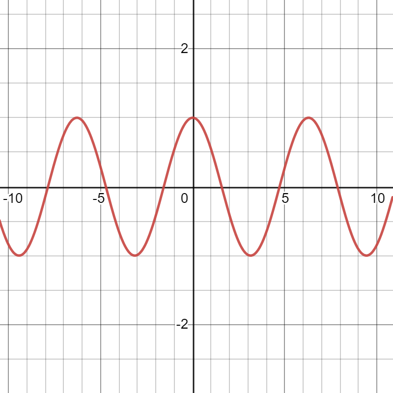 |
| ------------------------ | :---------------------------------------------------------: |
| domain                   |                  $ \theta \in \mathbb{R} $                  |
| range                    |                $ -1 \le cos(\theta) \le 1 $                 |
| $ cos(\theta) = 0 $ when |     $ \theta = {(2k+1)\pi \over 2}, k \in \mathbb{Z} $      |

| $ tan(\theta) = {y \over x} $ | 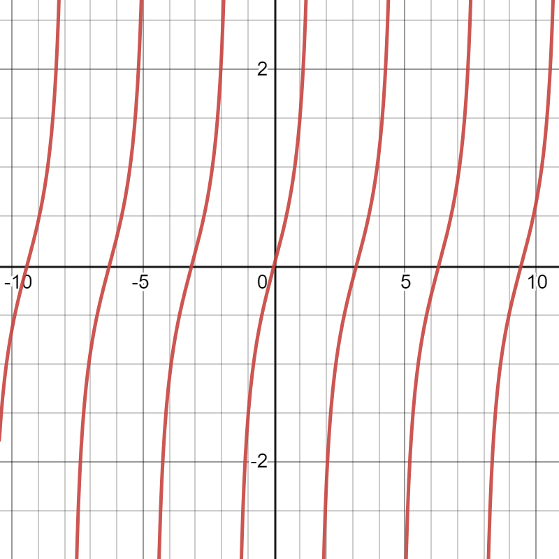  |
| ----------------------------- | :----------------------------------------------------------: |
| domain                        | $ \theta \in \mathbb{R}, \theta \ne {(2k+1)\pi \over 2}, k \in \mathbb{Z} $ |
| range                         |                $ tan(\theta) \in \mathbb{R} $                |
| $ tan(\theta) = 0 $ when      |             $ \theta = k\pi, k \in \mathbb{Z} $              |

| $ csc(\theta) = {1 \over y} $ | 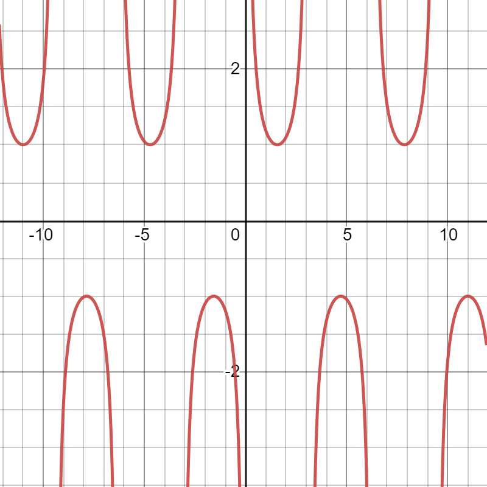  |
| ----------------------------- | :----------------------------------------------------------: |
| domain                        | $ \theta \in \mathbb{R}, \theta \ne k\pi, k \in \mathbb{Z} $ |
| range                         |       $ csc(\theta) \ge 1 $ or $ csc(\theta) \le -1 $        |
| $ csc(\theta) = 0 $ when      |                            never                             |

| $ sec(\theta) = {1 \over x} $ | 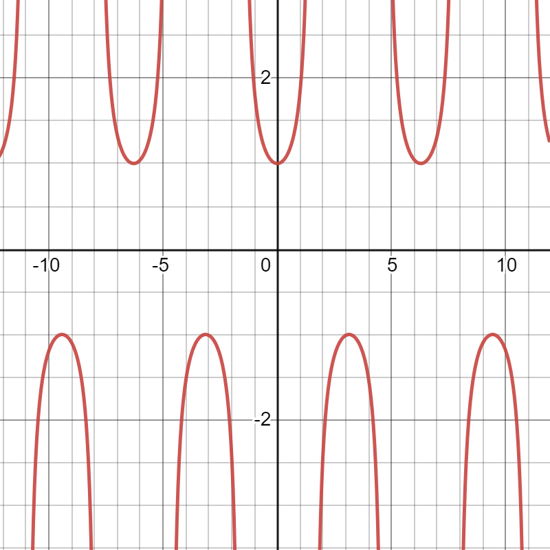  |
| ----------------------------- | :----------------------------------------------------------: |
| domain                        | $ \theta \in \mathbb{R}, \theta \ne {(2k+1)\pi \over 2}, k \in \mathbb{Z}  $ |
| range                         |       $ sec(\theta) \ge 1 $ or $ sec(\theta) \le -1 $        |
| $ sec(\theta) = 0 $ when      |                            never                             |

| $ cot(\theta) = {1x \over y} $ | 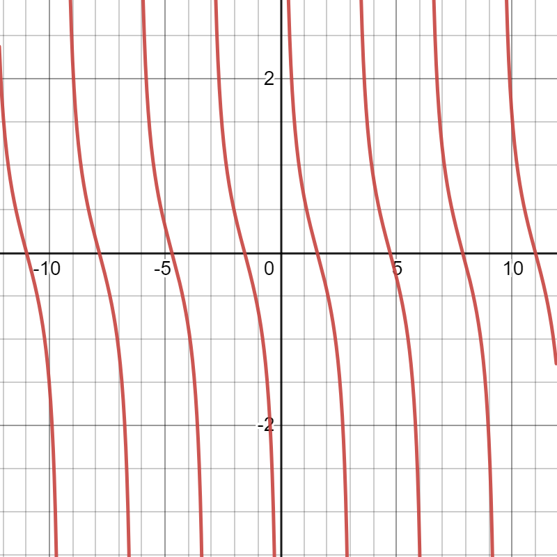  |
| ------------------------------ | :----------------------------------------------------------: |
| domain                         | $ \theta \in \mathbb{R}, \theta \ne k\pi, k \in \mathbb{Z} $ |
| range                          |                $ cot(\theta) \in \mathbb{R} $                |
| $ cot(\theta) = 0 $ when       |      $ \theta = {(2k+1)\pi \over 2}, k \in \mathbb{Z} $      |

**Special Triangles**

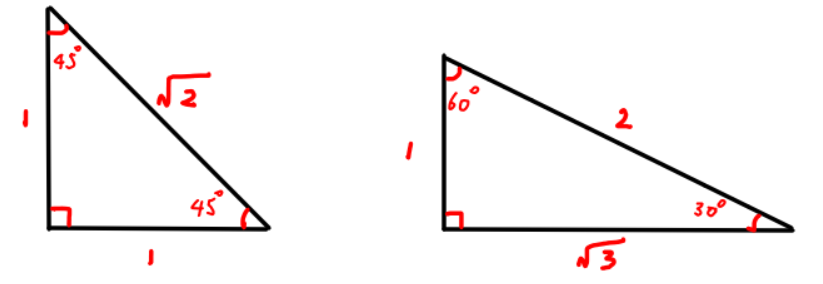

【Example】Evaluate each of the following.

(a) $ sin({\pi \over 4}) = {1 \over \sqrt{2}} = {\sqrt{2} \over 2} $

(b) $ cos({\pi \over 4}) = {1 \over 2} $

(c) $ csc({\pi \over 4}) = {\sqrt{2} \over 1} = \sqrt{2} $

【Example】Find all values of $ \theta $ satisfying the following.

(a) $ tan(\theta) = {1 \over \sqrt{3}} $

$ \theta = {\pi \over 6} $

(b) $ sec(\theta) = \sqrt{2} $

$ \theta = {\pi \over 4} $

(c) $ cot(\theta) = \sqrt{3} $

$ \theta = {\pi \over 6} $

**Trigonometric Identities**
$$
sin^2(\theta) + cos^2(\theta) = 1 \\
sin(-\theta) = -sin(\theta) \\
cos(-\theta) = -cos(\theta) \\
tan(\theta) = {sin(\theta) \over cos(\theta)} \\
cot(\theta) = {cos(\theta) \over sin(\theta)} \\
tan^2(\theta) + 1 = sec^2(\theta) \\
cot^2(\theta) + 1 = csc^2(\theta) \\
sin(\theta) = cos(\theta - {\pi \over 2}) \\
sin(a \pm b) = sin(a)cos(b) \pm cos(a)sin(b) \\
cos(a \pm b) = cos(a)cos(b) \mp sin(a)sin(b) \\
sin(2\theta) = 2sin(\theta)cos(\theta) \\
cos(2\theta) = cos^2(\theta) - sin^2(\theta) \\
sin^2(\theta) = {1 - cos(2\theta) \over 2} \\
cos^2(\theta) = {1 + cos(2\theta) \over 2}
$$
Reminder: $ trig^n(x) $ is a notation often used to indicate $ (trig(x))^n $.

 

## 1.4 Exponential Functions

**Exponential Functions**

Exponential functions are of the form $ y = a^x $, where $ a $ is a positive number and $ x $ is any real number. You might see these sorts of functions when studying population growth, economic growth, global temperature, monetary value, etc.

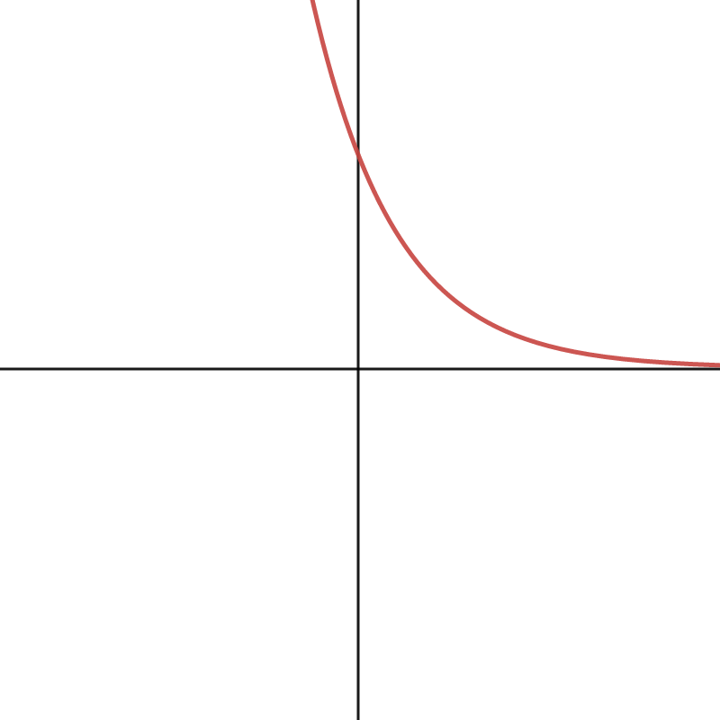

- Domain: $ x \in \mathbb{R} $

- Range: $ y > 0 $

- The graph $ y = a^x $ always passes through $ (0, 1) $ and $ (1, a) $.

- If $ a > 1$ then the graph of $ y = a^x $ is increasing.
- If $ 0 < a < 1 $ then the graph of  $ y = a^x $ is decreasing.
- $ y = 0 $ is always a horizontal asymptote of $ y = a^x $.

**Exponent Rules**
$$
a^{-x} = {1 \over a^x} \\
{1 \over a^{-x}} = a^x \\
(ab)^x = a^xb^x \\
({a \over b})^x = {a^x \over b^x} \\
a^{kx} = (a^k)^x = (a^x)^k \\
a^ma^n = a^{m+n} \\
{a^m \over a^n} = a^{m-n} \\
a^{1/n} = \sqrt[n]{a} \\
a^{m/n} = \sqrt[n]{a^m} = (\sqrt[n]{a})^m
$$

**The Base e**

A very special exponential function is $ y = e^x $, where $ e $ is just a content with a non-terminating decimal like $ \pi $.
$$
e = 2.718281845...
$$
What is so special about an exponential function with base $ e $?

At any point on the graph, the height of the exponential function is equal to the slope of the tangent line to the graph at that point.

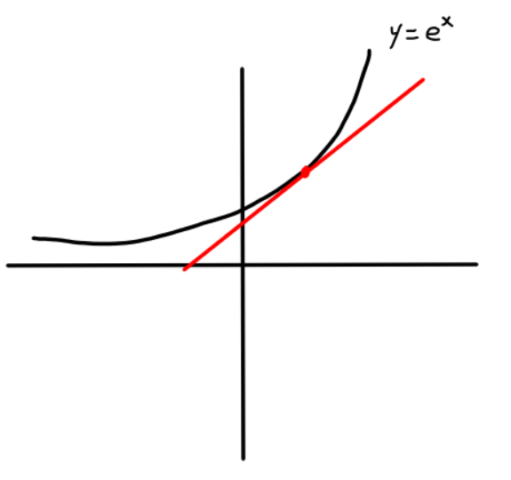

 

## 1.5 Logarithmic Functions

**Logarithmic Functions**

Logarithms are the inverse of exponential functions. Let $ a > 0$, then we define a logarithm (log) as follows:

if
$$
y = log_a(x)
$$
then
$$
a^y = x
$$
If no base $ a $ is shown, a base of 10 is assumed.

For example:
$$
log(x) = log_{10}(x)
$$
---

【Example】Evaluate each of the following.

(a) $ log_{2}8 = 3 $

(b) $ log(100) = 2 $

(c) $ log_{5}{1 \over 25} = -2 $

(d) $ log_{8}1 = 0 $

---

Since any positive number to the power of 0 is equal to 1, we have the property that $ log_a(1) $, no matter what the base $ a $ is.

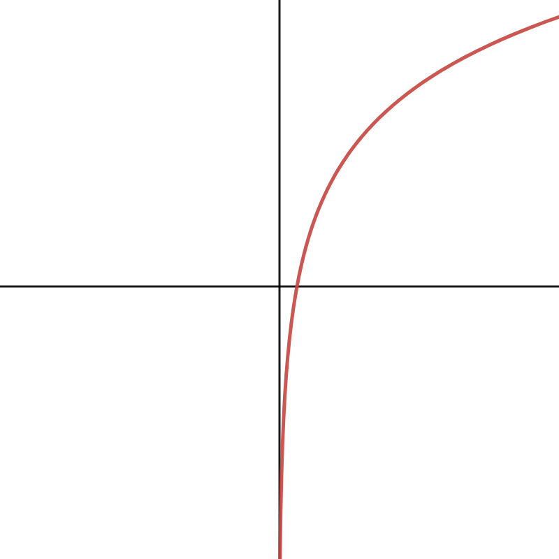

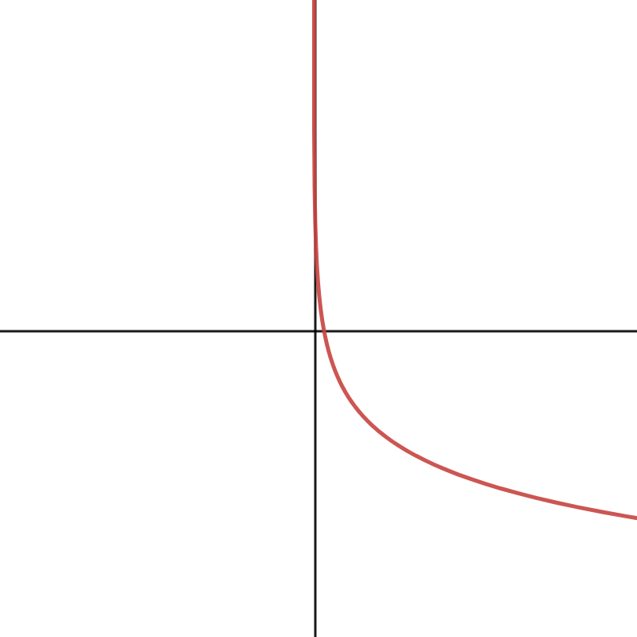

- Domain: $ 0 < x < \infin $
- Range: $ y \in \mathbb{R} $
- $ y = log_a(x) $ always passes through $ (a, 1) $ and $ (1, 0) $.
- If $ a > 1 $ then the graph of $ y = log_a(x) $ is increasing.
- If $ 0 < a < 1 $ then the graph of $ y = log_a(x) $ is decreasing.
- $ x = 0 $ is always a vertical asymptote of $ y = log_a(x) $.

**Logarithm Rules**
$$
log_a(a^x) = x \\
a^{log_a(x)} = x \\
log_a(xy) = log_a(x) + log_a(y) \\
log_a({x \over y}) = log_a(x) - log_a(y) \\
log_a(x^n) = nlog_a(x)
$$

**Change of Base Formula**

We can switch between any two bases easily by using the formula:
$$
log_a(x) = {log_b(x) \over log_b(a)}
$$
---

【Example】Proof
$$
\begin{aligned}

&\because y = log_a(x) \lrarr a^y = x \\

&\begin{aligned} \\
log_b(x) &= log_b(a^y) \\
        &= ylog_b(a) \\
        &= log_a(x) \cdot log_b(a) \\
\end{aligned} \\ \\

&\therefore {log_b(x) \over log_b(a)} = log_a(x)

\end{aligned}
$$

【Example】Convert $ log_4(x) $ into a logarithm with each of the following bases.

(a) base 3

$ log_3(x) = {log_4(x) \over log_4{3}} $

(b) base 22

$ log_{22}(x) = {log_4(x) \over log_4(22)} $

**The Natural Logarithm**

A special logarithm is the natural logarithm, which is the logarithm with a base of $ e $. Rather than write $ log_e(x) $, we typically write $ ln(x) $.

The natural logarithm has the exact same properties as any other logarithmic function.

In particular,
$$
ln(e^x) = x \\
e^{ln(x)} = x
$$
---

【Example】Solve each of the following for $ x $.

(a)
$$
\begin{aligned}
2^x &= 2^{1-x} \\
x &= 1 - x \\
2x &= 1 \\
x &= {1 \over 2}
\end{aligned}
$$

(b)
$$
\begin{aligned}
3^{{1 \over 2} + 10} &= 27 \\
3^{{1 \over 2} + 10} &= 3^3 \\
{1 \over 2}x + 10 &= 3 \\
{1 \over 2}x &= -7 \\
x &= - 14
\end{aligned}
$$

(c)
$$
\begin{aligned}
2^x &= 10 \\
ln(2^x) &= ln(10) \\
xln(2) &= ln(10) \\
x &= {ln(10) \over ln(2)}
\end{aligned}
$$

(d)
$$
\begin{aligned}
log(x) - 1 &= log(x - 1) \\
-1 &= log(x - 1) - log(x) \\
-1 &= log({x - 1 \over x}) \\
10^{-1} &= 10^{log({x - 1 \over x})} \\
{1 \over 10} &= {x - 1 \over x} \\
x &= 10(x - 1) \\
-9x &= -10 \\
x &= {10 \over 9}
\end{aligned}
$$

(e)
$$
\begin{aligned}
log_2(x) + log_2(x^2) &= 6 \\
log_2(x \cdot x^2) &= 6 \\
log_2(x^3) &= 6 \\
3log_2(x) &= 6 \\
log_2(x) &= 2 \\
x &= 4
\end{aligned}
$$

(f)
$$
\begin{aligned}
log_2(x^4) + log_2(x^2) &= 6 \\
log_2(x^4 \cdot x^2) &= 6 \\
log_2(x^6) &= 6 \\
2^{log_2(x^6)} &= 2^6 \\
x^6 &= 64 \\
x &= \pm 2
\end{aligned}
$$

 

# Chapter 2 Inequalities

## 2.1 Piecewise Functions

**Piecewise Functions**

Piecewise functions typically feature one or more points at which the function changes from one form to another. To graph a piecewise function, simply graph each piece and then restrict it to its designated domain. Pay special attention when plotting the breaking point (closed circle includes the point, open circle excludes the point).

---

【Example】Graph the piecewise function given by
$$
y = \begin{cases}
1 & x \le 0 \\
4^x & x > 0
\end{cases}
$$
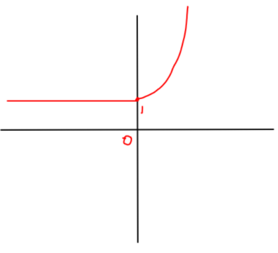

【Example】Graph the piecewise function given by
$$
y = \begin{cases}
{1 \over 2}x + 3 & x < -2 \\
0 & -2 \le x \le 2 \\
x^2 - 1 & x > 2
\end{cases}
$$
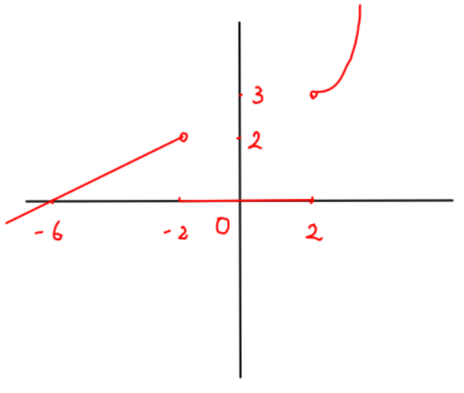

 

## 2.2 Absolute Value Functions

**Absolute Value Functions**

A very special and common piecewise function is the absolute value function.

basic form: $ y = |x| = \begin{cases} x & x \ge 0 \\ -x & x < 0 \end{cases} $

domain: $ x \in \mathbb{R} $

range: $ y \ge 0 $

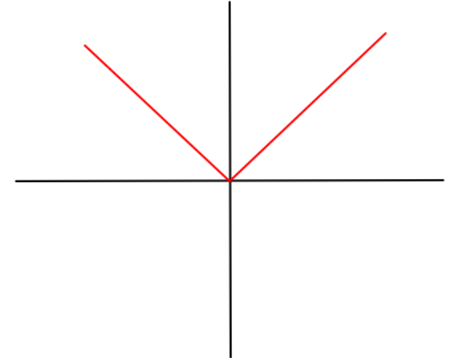
$$
|ab| = |a| \cdot |b| \\
|{a \over b}| = {|a| \over |b|} \\
if\ |a| \le b,\ then\ -b \le a \le b \\
if\ |a| \ge b,\ then\ a \ge b \ or \ a \le -b \\
(Triangle \ Inequality)\ |a + b| \le |a| + |b|
$$

 

## 2.3 Inequalities Notation

**Inequalities Notation**

When solving equation we may get a single answer, or a number of answers that satisfy the equation.

Consider $ 3x - 5 = 1 $, only one value satisfies this equation.

But if we consider $ x^2 - 1 = 3 $, more than one value satisfies this equation.

Inequalities notation like $ 1 \le x < 3 $, where the symbols $ \le $ and $ \ge $ indicate inclusion of an endpoint, and $ < $ and  > $ indicate exclusion of an endpoint.

A second notation is interval notation, for example, $ x \in [1, 3) $, where a square (or closed) bracket indicates inclusion of an endpoint, and a round (or open) bracket indicates exclusion of an endpoint.

The infinity symbol $ \infin $ is always accompanied by round brackets.

---

【Example】Write each of the following in interval notation.

(a) $ 2 \le x \le 7 $

$ x \in [2, 7] $

(b) $ x < 9 $

$ x \in (-\infin, 9) $

(c) $ -3 > x > 0 $

$ x \in \empty $

【Example】Write each of the following using inequalities.

(a) $ x \in [3, 6) $

$ 3 \le x < 6 $

(b) $  x \in (-2, 4) $

$ -2 < x < 4 $

(c) $ x \in (-\infin, -1] $

$ x \le -1 $

---

It is possible to have ranges of values that are disjoint. We use the union symbol $ \bigcup $ to include all of the values in any of the disjoint ranges. For example, $ [-1, 4) \bigcup [7, 10) $ meas $ -1 \le x < 4 $ or $ 7 \le x < 10 $.

---

【Example】Express each of the following in interval notation.

(a) $ -3 \le x < {1 \over 2} $ or $ 4 < x < 7 $

$ x \in [-3, {1 \over 2}] \bigcup (4, 7) $

(b) $ 1 \le x < 5 $ or $ 3 \le x < 7 $

$ x \in [1, 7) $

(c) $ x \in [-2, 6) \bigcup (0, 5) $

$ x \in [-2, 6) $

---

Intersection symbol $ \bigcap $ allows only the values that are common between intervals. For example, $ [-1, 6) \bigcap (2, 7) $ means $ (2, 6) $.

---

【Example】Express each of the following in interval notation.

(a) $ -2 < x \le 6 $ and $ 0 < x < 7 $

$ x \in (0, 6] $

(b) $ x \in [0, 5] \bigcap [3, 5] $

$ x \in [3, 5] $

(c) $ -4 < x < 0 $ and $ 3 < x < 7 $

$ x \in \empty$

**Solving Inequalities**

When solving inequalities, there are a few rules that we must follow:

1. When it comes to addition, subtraction, multiplication, and division, what you do to one side of the inequality, you must do to the other.
2. If you multiply or divide by a negative quantity, you must flip the inequality.
3. If both sides are positive or both sides are negative, then you can take the reciprocal of both sides, but you must flip the inequality.

---

【Example】Find all values of x that satisfy the following.

(a)
$$
\begin{aligned}
-6x + 7 &\ge 8x \\
-14x &\ge -7 \\
x &\le {1 \over 2}
\end{aligned}
$$

(b)
$$
\begin{aligned}
-{5 \over 2} < 4 - 2x \le 1 \\
-{13 \over 2} < -2x \le -3 \\
{13 \over 4} > x \ge {3 \over 2} \\
x \in [{3 \over 2}, {13 \over 4})
\end{aligned}
$$

(c)
$$
\begin{aligned}
5x^3 + 27 &> -13 \\
5x^3 &> -40 \\
x^3 &> -8 \\
x &> -2
\end{aligned}
$$

(d)
$$
\begin{aligned}
3x^2 + 2 &< -4 \\
3x^2 &< -6 \\
x^2 &< -2 \\
x &\in \empty
\end{aligned}
$$

(e)
$$
\begin{aligned}
\sqrt{x-1} &> 4 \\
x - 1 &> 16 \\
x &> 17
\end{aligned}
$$

(f)
$$
\begin{aligned}
log_2(3x) &\le -3 \\
2^{log_2(3x)} &\le 2^{-3} \\
3x &\le {1 \over 8} \\
x &\le {1 \over 24}
\end{aligned}
$$

## 2.4 The Case Method

**The Case Method**

Consider the following example: $ {x - 3 \over x - 1} < 10 $

You might be tempted to cross multiply, but be careful! The quantity $ x - 1$ is not always positive. If we multiply by $ x - 1$, the inequality needs to flip for some values of $ x $. How might we deal with this?

1. Separate into 2 cases

    |                          Case 1                          |                          Case 2                          |
    | :------------------------------------------------------: | :------------------------------------------------------: |
    | $$ \begin{aligned} x - 1 &> 0 \\ x &> 1 \end{aligned} $$ | $$ \begin{aligned} x - 1 &< 0 \\ x &< 1 \end{aligned} $$ |

2. Solve the original problem under each assumption

    |                            Case 1                            |                            Case 2                            |
    | :----------------------------------------------------------: | :----------------------------------------------------------: |
    | $$ \begin{aligned} {x-3 \over x-1} &< 10 \\ x - 3 &< 10(x-1) \\ -9x &< -7 \\ x &> {7 \over 9} \end{aligned} $$ | $$ \begin{aligned} {x-3 \over x-1} &< 10 \\ x - 3 &> 10(x-1) \\ -9x &> -7 \\ x &< {7 \over 9} \end{aligned} $$ |

3. Find all common points between assumption and solution

    |                            Case 1                            |                            Case 2                            |
    | :----------------------------------------------------------: | :----------------------------------------------------------: |
    | $$ \begin{aligned} x > 1 \ and \ x > {7 \over 9} \\ x \in (1, \infin) \end{aligned} $$ | $$ \begin{aligned} x < 1 \ and \ x < {7 \over 9} \\ x \in (-\infin, {7 \over 9}) \end{aligned} $$ |

4. Consolidate the 2 cases by taking the union
    $$
    x \in (1, \infin) \bigcup (-\infin, {7 \over 9})
    $$

---

【Example】Find all values of x such that $ {7x - 2 \over 1 - 2x}  \ge 4 $.

1. Separate into 2 cases

    |                            Case 1                            |                            Case 2                            |
    | :----------------------------------------------------------: | :----------------------------------------------------------: |
    | $$ \begin{aligned} 1 - 2x &> 0 \\ x &< {1 \over 2} \end{aligned} $$ | $$ \begin{aligned} 1 - 2x &< 0 \\ x &> {1 \over 2} \end{aligned} $$ |

2. Solve the original problem under each assumption

    |                            Case 1                            |                            Case 2                            |
    | :----------------------------------------------------------: | :----------------------------------------------------------: |
    | $$ \begin{aligned} {7x-2 \over 1-2x} &\ge 4 \\ 7x - 2 &\ge 4(1-2x) \\ 15x &\ge 6 \\ x &\ge {2 \over 5} \end{aligned} $$ | $$ \begin{aligned} {7x-2 \over 1-2x} &\ge 4 \\ 7x - 2 &\le 4(1-2x) \\ 15x &\le 6 \\ x &\le {2 \over 5} \end{aligned} $$ |

3. Find all common points between assumption and solution

    |                            Case 1                            |                            Case 2                            |
    | :----------------------------------------------------------: | :----------------------------------------------------------: |
    | $$ \begin{aligned} x < {1 \over 2} \ and \ x \ge {2 \over 5} \\ x \in [{2 \over 5}, {1 \over 2}) \end{aligned} $$ | $$ \begin{aligned} x > {1 \over 2} \ and \ x \le {2 \over 5} \\ x \in \empty \end{aligned} $$ |

4. Consolidate the 2 cases by taking the union
    $$
    x \in [{2 \over 5}, {1 \over 2})
    $$

## 2.5 The Number Line Method

**The Number Line Method**

Another method for solving inequalities uses the following basic logic:
$$
\begin{aligned}
(+)(+) = + && {(+) \over (+)} = + \\
(-)(-) = + && {(-) \over (-)} = + \\
(+)(-) = - && {(+) \over (-)} = - \\
(-)(+) = - && {(-) \over (+)} = -
\end{aligned}
$$

By manipulating expressions into factors that are multiplied and/or divided on one side of the inequality (with a zero appearing on the other side), we can simply consider the combinations of positive and negative factors to draw conclusions.

---

【Example】Find all values of x that satisfy $ 3x^2 - 13x > -10 $.
$$
\begin{aligned}
3x^2 - 13x &> -10 \\
3x^2 - 13x + 10 &> 0 \\
3x(x-1) - 10(x-1) &> 0 \\
(x-1)(3x-10) &> 0 \\
\end{aligned}
$$
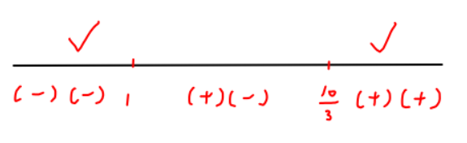
$$
x \in (-\infin, 1) \bigcup ({10 \over 3}, \infin)
$$

【Example】Find all values of x that satisfy $ x - 2 \ge {4 \over x+1} $.
$$
\begin{aligned}
x - 2 &\ge {4 \over x+1} \\
(x-2)(x+1) - 4 \over x+1 &\ge 0 \\
x^2 - x - 6 \over x + 1 &\ge 0 \\
(x-3)(x+2) \over x+1 &\ge 0 \\
\end{aligned}
$$
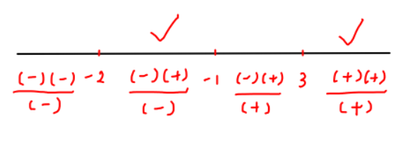
$$
x \in [-2, 1) \bigcup [3, \infin)
$$

# Chapter 3 Limits and Continuity

## 3.1 Basic Limits

**Basic Limits**

Suppose we have a function $ y = f(x) $. The limit of $ f(x) $ as $ x $ approaches the number $ a $, denoted $ \lim\limits_{x \rarr a}f(x) $.

For example, suppose we wanted to determine $ \lim\limits_{x \rarr 3}x^2 $.

| $ x $ approaches 3 from the left | $ x $ approaches 3 from the right |
| :------------------------------: | :-------------------------------: |
|        $ f(2.9) = 8.41 $         |         $ f(3.1) = 9.61 $         |
|       $ f(2.99) = 8.9401 $       |       $ f(3.01) = 9.0601 $        |
|     $ f(2.999) = 8.994001 $      |      $ f(3.001) = 9.006001 $      |

No matter which way we approach from, as $ x $ gets close 3, we can see that $ x^2 $ gets very close to 9.

---

【Example】Find  $ \lim\limits_{x \rarr 0}f(x) $ where
$$
f(x) = \begin{cases}
	cos(x) & x \ne 0 \\
	-1 & x = 0
\end{cases}
$$
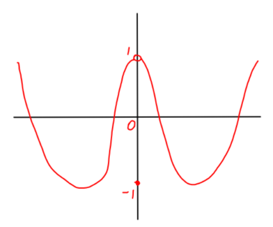

$ \lim\limits_{x \rarr 0}f(x) = 1$

$ f(0) = -1 $

**Law of Limits**
$$
\lim\limits_{x \rarr a}(f+g)(x) = \lim\limits_{x \rarr a}f(x) + \lim\limits_{x \rarr a}g(x) \\
\lim\limits_{x \rarr a}(f-g)(x) = \lim\limits_{x \rarr a}f(x) - \lim\limits_{x \rarr a}g(x) \\
\lim\limits_{x \rarr a}(fg)(x) = \lim\limits_{x \rarr a}f(x) \cdot \lim\limits_{x \rarr a}g(x) \\
\lim\limits_{x \rarr a}({f \over g})(x) = {\lim\limits_{x \rarr a}f(x) \over \lim\limits_{x \rarr a}g(x)}\\
$$
---

【Example】Evaluate $ \lim\limits_{x \rarr 0}xsin({1 \over x}) $.
$$
-1 \le sin({1 \over x}) \le 1 \\
-x \le xsin({1 \over x}) \le x \\
\lim\limits_{x \rarr 0}-x \le \lim\limits_{x \rarr 0}xsin({1 \over x}) \le \lim\limits_{x \rarr 0}x \\
\therefore \lim\limits_{x \rarr 0}xsin({1 \over x}) = 0
$$

**One-sided Limits**

$ x $ can approach the value a in two ways:

- left-hand limit: $ \lim\limits_{x \rarr a^-}f(x) $
- right-hand limit: $ \lim\limits_{x \rarr a^+}f(x) $

We can tighten our definition of the limit of a function $ f(x) $ as $ x $ approaches $ a $. If the left-hand and right-hand limits of $ f(x) $ are both equal to a number $ L $, then we say that $ \lim\limits_{x \rarr a}f(x) $ exists and is equal to $ L $.

---

【Example】Consider the piecewise function given by
$$
f(x) = \begin{cases}
	x & x < 1 \\
	-1 & x = 1 \\
	\sqrt{x-1} & x > 1
\end{cases}
$$
(a) $ \lim\limits_{x \rarr 1^-}f(x) = 1 $

(b) $ \lim\limits_{x \rarr 1^+}f(x) = 0 $

(c) $ f(1) = -1 $

(d) Does $ \lim\limits_{x \rarr 1}f(x) $ exist? No.

## 3.2 Continuity

**Continuity**

It seems like sometimes we can evaluate a limit by just plugging in, but sometimes we can’t!

---

【Example】Evaluate $ \lim\limits_{x \rarr 1}(ln(\sqrt{x}) + {1 \over x}) $.
$$
\begin{aligned}
& \lim\limits_{x \rarr 1}(ln(\sqrt{x}) + {1 \over x}) \\
&= ln(\sqrt{x} + {1 \over x}) \\
&= ln(\sqrt(1)) + {1 \over 1} \\
&= 0 + 1 \\
&= 1
\end{aligned}
$$
---

A function is continuous at a point a if each of the following conditions hold:

1. $ \lim\limits_{x \rarr a}f(x) $ exists
2. $ f(a) $ exists
3. $ \lim\limits_{x \rarr a}f(x) = f(a) $

**Discontinuity**

Kinds of discontinuities:

|                          essential                          |                          removable                          |                            jump                             |
| :---------------------------------------------------------: | :---------------------------------------------------------: | :---------------------------------------------------------: |
| 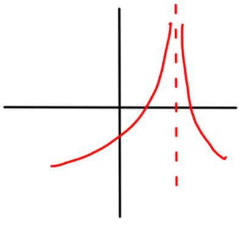 | 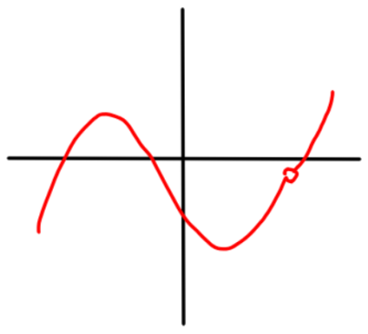 | 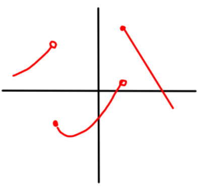 |

So far, we know that evaluating $ \lim\limits_{x \rarr a}f(x) $ is easy if $ f(x) $ is continuous at $ a $. But what if it isn’t? The limit may still exist.

---

【Example】Evaluate the following limits.

(a) $ \lim\limits_{x \rarr 3^+}{1 \over 3-x} = -\infin $

(b) $ \lim\limits_{x \rarr 3^-}{1 \over 3-x} = \infin $

(c) $ \lim\limits_{x \rarr 0^+}ln(x) = -\infin $

(d) $ \lim\limits_{x \rarr -{\pi \over 2}^+}sec(x) = \infin $

---

A function doesn’t have to go to $ \pm \infin $ at a discontinuity though. Consider, for instance, evaluating $ \lim\limits_{x \rarr 3}{x^2-x-6 \over x-3} $. Plugging in $ x = 3 $ gives us "$ 0 / 0 $", which is known as an indeterminate form.

A good first step is to factor where possible. Once we cancel the factor $ x - 3 $ on top and bottom, this function is just the function $ f(x) = x + 2 $, but with a hole at $ x = 3 $. The hole is there because we cannot ignore that the original form of the function had issues at $ x = 3 $.

---

【Example】Evaluate the following limits.

(a)

$$
\begin{aligned}
& \lim\limits_{x \rarr 3}{x^2-x-6 \over x-3} \\
&= \lim\limits_{x \rarr 3}{(x-3)(x+2) \over x-3} \\
&= \lim\limits_{x \rarr 3}{x+2 \over x-3} \\
&= 5
\end{aligned}
$$

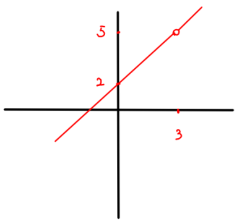

(b)
$$
\begin{aligned}
& \lim\limits_{x \rarr -1}{x^3 - 11x^2 + 8x + 20 \over x + 1} \\
&= \lim\limits_{x \rarr -1}{(x+1)(x^2-12x+20) \over x + 1} \\
&= (-1)^2 - 12(-1) + 20 \\
&= 33
\end{aligned}
$$

(c)
$$
\begin{aligned}
& \lim\limits_{x \rarr 4}{\sqrt{x+5} - 3 \over x-4} \\
&= \lim\limits_{x \rarr 4}{({{\sqrt{x+5}-3} \over {x-4}})({{\sqrt{x+5}+3} \over \sqrt{x+5}+3})} \\
&= \lim\limits_{x \rarr 4}{x-4 \over (x-4)(\sqrt{x+5}+3)} \\
&= {1 \over \sqrt{9} + 3} \\
&= {1 \over 6}
\end{aligned}
$$

(d)
$$
\begin{aligned}
& \lim\limits_{x \rarr 2}{{1 \over x-4} + {1 \over 2} \over x-2} \\
&= \lim\limits_{x \rarr 2}{{{2+(x-4)} \over {2(x-4)}} \over x-2} \\
&= \lim\limits_{x \rarr 2}{({x-2 \over 2x-4})({1 \over x-2})} \\
&= \lim\limits_{x \rarr 2}{1 \over 2(x-4)} \\
&= {1 \over 2(-2)} \\
&= -{1 \over 4}
\end{aligned}
$$

## 3.3 The Fundamental Sine Limit

**The Fundamental Sine Limit**

Consider the following limit:
$$
\lim\limits_{x \rarr 0}{sin(x) \over x}
$$
We can quickly see that this is a "$ 0 / 0 $" limit, and therefore is indeterminate. We can’t factor anything or otherwise simplify the expression to get rid of the issue.

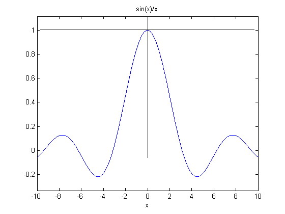

It is pretty clear from the graph that
$$
\lim\limits_{x \rarr 0}{sin(x) \over x} = \lim\limits_{x \rarr 0}{x \over sin(x)} = 1
$$
---

【Example】Evaluate the following limits.

(a)
$$
\begin{aligned}
& \lim\limits_{t \rarr 0}{5sin(t) \over 2t} \\
&= \lim\limits_{t \rarr 0}{{5 \over 2} \cdot {sin(t) \over t}} \\
&= {5 \over 2}
\end{aligned}
$$

(b)
$$
\begin{aligned}
& \lim\limits_{\theta \rarr 0}{\theta \over sin(4\theta)} \\
&= \lim\limits_{\theta \rarr 0}{4\theta \over 4sin(4\theta)} \\
&= \lim\limits_{\theta \rarr 0}{{1 \over 4}{4\theta \over sin(4\theta)}} \\
&= {1 \over 4}
\end{aligned}
$$

(c)
$$
\begin{aligned}
& \lim\limits_{x \rarr -1}{sin^2(x+1) \over (x+1)^2} \\
&= \lim\limits_{x \rarr -1}{{sin(x+1) \over x+1} \cdot {sin(x+1) \over x+1}} \\
&= 1
\end{aligned}
$$

(d)
$$
\begin{aligned}
& \lim\limits_{x \rarr 0}{sin(3x) \over sin(2x)} \\
&= \lim\limits_{x \rarr 0}{{sin(3x) \over 3} \cdot {2x \over sin(2x)} \cdot {3 \over 2}} \\
&= {3 \over 2}
\end{aligned}
$$

(e)
$$
\begin{aligned}
& \lim\limits_{\theta \rarr 0}{100\theta \over tan(3\theta)} \\
&= \lim\limits_{\theta \rarr 0}{10\theta \cdot {cos(3\theta) \over sin(3\theta)}} \\
&= \lim\limits_{\theta \rarr 0}{{3\theta \over sin(3\theta)} \cdot {1 \over 3} \cdot 10 \cdot cos(3\theta)} \\
&= 1 \cdot {10 \over 3} \cdot 1 \\
&= {10 \over 3}
\end{aligned}
$$

(f)
$$
\begin{aligned}
& \lim\limits_{h \rarr 0}{cos(h)-1 \over h} \\
&= \lim\limits_{h \rarr 0}{({cos(h)-1 \over h})({cos(h)+1 \over cos(h)+1})} \\
&= \lim\limits_{h \rarr 0}{cos^2h - 1 \over h(cos(h) + 1)} \\
&= \lim\limits_{h \rarr 0}{-sin^2h \over h(cos(h) + 1)} \\
&= \lim\limits_{h \rarr 0}{-{sin(h) \over h} \cdot {sin(h) \over cos(h) + 1}} \\
&= -1 \cdot {0 \over 1+1} \\
&= 0
\end{aligned}
$$

## 3.4 Limits Approaching $ \pm \infin $

**Limits Approaching $ \pm \infin $**

Sometimes, we will be interested in determining what happens as $ x $ gets really big, either in the positive or negative direction.

---

【Example】Evaluate the following limits.

(a) $ \lim\limits_{x \rarr \infin}{1 \over x} = 0 $

(b) $ \lim\limits_{x \rarr -\infin}{1 \over x} = 0 $

(c) $ \lim\limits_{x \rarr -\infin}{401 \over x^203} = 0 $

(d) $ \lim\limits_{x \rarr -\infin}{-238 \over 23x^{1/4}} = 0 $

---

For problems like $ \lim\limits_{x \rarr \infin}{2x^2 + 3x + 1 \over x^2 - 10x + 100} $, a good first step is to divide the top and the bottom by the highest power of $ x $ appearing in the denominator.

---

【Example】Evaluate the following limits.

(a)
$$
\begin{aligned}
& \lim\limits_{x \rarr \infin}{2x^2 + 3x + 1 \over x^2 - 10x + 100} \\
&= \lim\limits_{x \rarr \infin}{({2x^2+3x+1 \over x^2-10x+100})({1/x^2 \over 1/x^2})} \\
&= \lim\limits_{x \rarr \infin}{({2x^2+3x+1 \over x^2-10x+100})({1/x^2 \over 1/x^2})} \\
&= \lim\limits_{x \rarr \infin}{{2 + {3 \over x} + {1 \over x^2}} \over {1 - {10 \over x} + {100 \over x^2}}} \\
&= {2 \over 1} \\
&= 2
\end{aligned}
$$

(b)
$$
\begin{aligned}
& \lim\limits_{x \rarr -\infin}{3 - 2x^3 \over 1 + x + x^2} \\
&= \lim\limits_{x \rarr -\infin}{({3-2x^3 \over 1+x+x^2})({1/x^2 \over 1/x^2})} \\
&= \lim\limits_{x \rarr -\infin}{{3 \over x^2} - 2x \over {{1 \over x^2} + {1 \over x} + 1}} \\
&= \lim\limits_{x \rarr -\infin}{-2x \over 1} \\
&= \infin
\end{aligned}
$$

(c)
$$
\begin{aligned}
& \lim\limits_{x \rarr \infin}{\sqrt{x^2 - x + 1}} \\
&= \lim\limits_{x \rarr \infin}{(\sqrt{x^2-x+1}-x)({\sqrt{x^2-x+1}+x \over \sqrt{x^2-x+1}+x})} \\
&= \lim\limits_{x \rarr \infin}{(x^2-x+1)-x^2 \over \sqrt{x^2-x+1}+x} \\
&= \lim\limits_{x \rarr \infin}{x+1 \over \sqrt{x^2-x+1}+x} \\
&= \lim\limits_{x \rarr \infin}{({x+1 \over \sqrt{x^2-x+1}+x})({1/x \over 1/x})} \\
&= \lim\limits_{x \rarr \infin}{-1 + {1 \over x} \over {\sqrt{x^2-x+1} \over x} + 1} \\
&= \lim\limits_{x \rarr \infin}{-1 + {1 \over x} \over \sqrt{{x^2-x+1} \over x^2} + 1} \\
&= \lim\limits_{x \rarr \infin}{-1 \over \sqrt{1} + 1} \\
&= -{1 \over 2}
\end{aligned}
$$

(d)
$$
\begin{aligned}
& \lim\limits_{t \rarr \infin}{\sqrt{3t^2 + 2t + 5} + t} \\
&= \infin
\end{aligned}
$$

# Chapter 4 Derivatives

## 4.1 The First Principles

**The First Principles**

The equation of a line $ y = mx + b $ where $ b $ is the y-intercept and $ m $ is the slope of the line. Calculating the slope is easy using any two points on the line $ (x_1, y_1) $ and $ (x_2, y_2) $.

$$
m
= {\Delta y \over \Delta x}
= {{y_2 - y_1} \over {x_2 - x_1}}
= {f(x_2) - f(x_1) \over x_2 - x_1}
= {f(x + h) - f(x) \over h}
$$
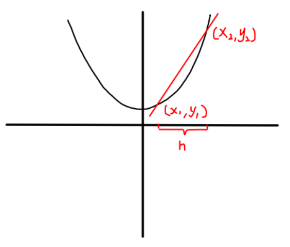

What if we made the point even closer to $ (x, f(x)) $?

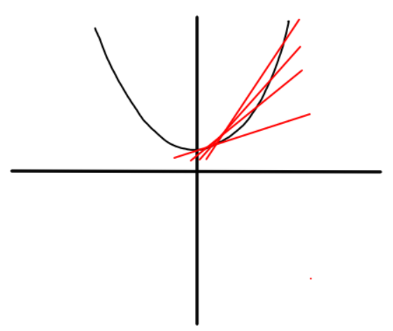

As $ h $ gets smaller and smaller, the point $ (x+h, f(x+h)) $ approaches the point $ (x, f(x)) $. As this occurs, the slope of the secant line approaches the slope of the tangent line. We can write this action mathematically as:
$$
\lim\limits_{h \rarr 0}{f(x+h) - f(x) \over h}
$$
If this limit exists as a finite number, the this value is equal to the slope of the tangent line. This is the instantaneous rate of $ f(x) $ at the point $ (x, f(x)) $. This very special limit is also called the derivative of $ f(x) $ at $ (x, f(x)) $.

If $ y = f(x) $, then we can denote the derivative in a few different ways:
$$
\begin{aligned}
{dy \over dx} && y' && f'(x)
\end{aligned}
$$
When $ f(x) $ has a derivative at $ (a, f(a)) $, we say that $ f(x) $ is differentiable at the value $ x = a $. This means that
$$
\lim\limits_{h \rarr 0^-}{f(x+h) - f(x) \over h} = \lim\limits_{h \rarr 0^+}{f(x+h) - f(x) \over h}
$$
---

【Example】From The First Principles, find the derivatives.

(a) $ f(x) = x^2 $

$$
\begin{aligned}
f'(x) &= \lim\limits_{h \rarr 0}{f(x+h) - f(x) \over h} \\
	&= \lim\limits_{h \rarr 0}{(x+h)^2 - x^2 \over h} \\
	&= \lim\limits_{h \rarr 0}{x^2 + 2xh + h^2 - x^2 \over h} \\
	&= \lim\limits_{h \rarr 0}{h(2x+h) \over h} \\
	&= \lim\limits_{h \rarr 0}{2x + h} \\
	&= 2x
\end{aligned}
$$

(b) $ f(x) = \sqrt{x+2} $
$$
\begin{aligned}
f'(x) &= \lim\limits_{h \rarr 0}{f(x+h) - f(x) \over h} \\
	&= \lim\limits_{h \rarr 0}{\sqrt{(x+h)+2} - \sqrt{x+2} \over h} \\
	&= \lim\limits_{h \rarr 0}{({\sqrt{(x+h)+2} - \sqrt{x+2} \over h})({\sqrt{(x+h)+2} + \sqrt{x+2} \over \sqrt{(x+h)+2} + \sqrt{x+2}})} \\
	&= \lim\limits_{h \rarr 0}{x+h+2 - (x+2) \over h(\sqrt{x+h+2} + \sqrt{x+2})} \\
	&= \lim\limits_{h \rarr 0}{1 \over h(\sqrt{x+h+2} + \sqrt{x+2})} \\
	&= {1 \over \sqrt{x+2} + \sqrt{x+2}} \\
	&= {1 \over 2\sqrt{x+2}}
\end{aligned}
$$

【Example】From The First Principles, find the derivative of $ f(x) = {1 \over x} $ at $ x = 5 $.
$$
\begin{aligned}
f'(x) &= \lim\limits_{h \rarr 0}{f(x+h) - f(x) \over h} \\
	&= \lim\limits_{h \rarr 0}{{1 \over x+h} - {1 \over x} \over h} \\
    &= \lim\limits_{h \rarr 0}{{x-(x+h) \over x(x+h)} \over h} \\
    &= \lim\limits_{h \rarr 0}{{-h \over x(x+h)} \cdot {1 \over h}} \\
    &= \lim\limits_{h \rarr 0}{-{1 \over x(h+h)}} \\
    &= -{1 \over x^2} \\
    \\
    f'(5) &= -{1 \over x^2} \\
    	&= -{1 \over 25}
\end{aligned}
$$

## 4.2 Differentiability and Continuity

**Differentiability and Continuity**

A non-differentiable function has one of the following properties:

|                            Corner                            |                         Sudden Turn                          |                          Asymptote                           |           Left-hand Limit $ \ne $ Right-hand Limit           |
| :----------------------------------------------------------: | :----------------------------------------------------------: | :----------------------------------------------------------: | :----------------------------------------------------------: |
| 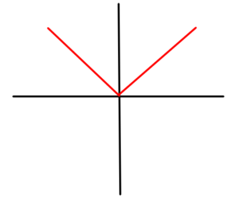 | 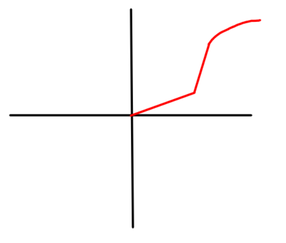 | 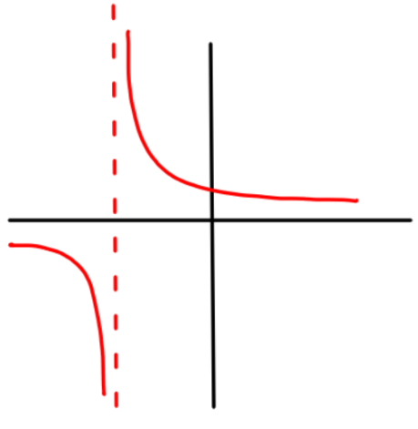 | 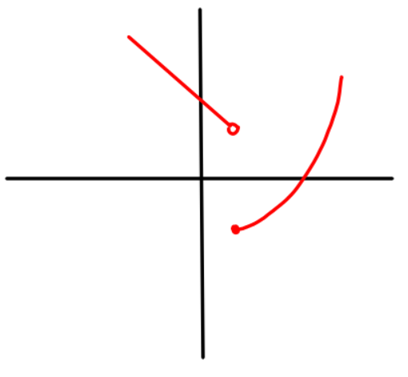 |

In all of these cases, the limit of the slopes does not exist at a point. Functions are not differentiable at such points.

Differentiability implies continuity, but the reverse is not true. Consider the function $ y = |x| $ as a counterexample. This function is continuous for all values of $ x $, but it is not differentiable at $ x = 0 $, because there is a corner there. The limit of the slopes does not exist at $ x = 0$.

---

【Example】Discuss the continuity and differentiability.

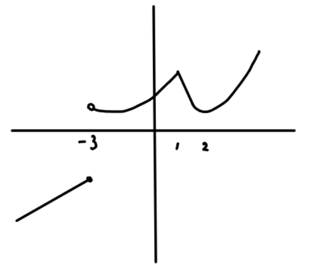

(a) $ x = 2 $: continuous and differentiable

(b) $ x = 1 $: continuous and not differentiable

(c) $ x = -3 $: not continuous and not differentiable

## 4.3 Derivative Rules

**Derivative Rules**

The First Principles definition of the limit can become a cumbersome task when functions get complicated. Luckily, there are rules for finding derivatives more quickly depending on their form. All of these rules are derived from The First Principles.

1. Power Rule

    Let $ f(x) = x^n $, then $ f'(x) = nx^{n-1} $.

    ---

    【Example】Find the derivative of $ f(x) = x^7 $.
    $$
    f'(x) = 7x^6
    $$
    

2. Derivative of a Constant

    Let $ f(x) = k $, then $ f'(x) = 0 $. Graphically, since a constant function is a horizontal line, so its slope must be zero.

    ---

    【Example】Find the derivative of $ f(x) = 672 $.
    $$
    f'(x) = 0
    $$
    

3. Derivatives of Logarithmic Functions

    $ {d \over dx}log_a{x} = {1 \over xln(a)} $, where $ a > 0 $ and $ a \ne 1 $

    $ {d \over dx}ln(x) = {d \over dx}log_e(x) = {1 \over xln(e)} = {1 \over x} $

    ---

    【Example】Find the derivative of $ f(x) = log_4(x) $.
    $$
    f'(x) = {1 \over xln(4)}
    $$
    

4. Derivatives of Exponential Functions

    $ {d \over dx}a^x = a^xln(a) $, where $ a > 0 $ and $ a \ne 1 $

    $ {d \over dx}e^x = e^xln(e) = e^x $

    ---

    【Example】Find the derivative of $ f(x) = 5^x $.
    $$
    f'(x) = 5^xln(5)
    $$
    

5. Derivatives of Trigonometric Functions
    $$
    \begin{aligned}
    {d \over dx}sin(x) &= cos(x) \\
    {d \over dx}csc(x) &= -csc(x)cot(x) \\
    {d \over dx}cos(x) &= -sin(x) \\
    {d \over dx}sec(x) &= sec(x)tan(x) \\
    {d \over dx}tan(x) &= sec^2(x) \\
    {d \over dx}cot(x) &= -csc^2(x)
    \end{aligned}
    $$
    Memory tool: if the trigonometric function starts with `c`, then its derivative has a minus sign.

---

What about combining these basic derivative rules for functions? That is, how do we find the derivatives of the addition, subtraction, multiplication, division, or take the constant of functions? For all of the following rules, we assume that f and g are differentiable on their domains.

1. Multiplication by a Constant

    $ (kf(x))' = kf'(x) $

    ---

    【Example】Find the derivative of $ f(x) = 5ln(x) $.
    $$
    f'(x) = 5({1 \over x}) = {5 \over x}
    $$
    

2. Sum / Difference

    $ (f \pm g)'(x) = f'(x) \pm g'(x) $

    ---

    【Example】Find the derivative of $ f(x) = ln(x) + 4x^3 - 6csc(x) $.
    $$
    \begin{aligned}
    f'(x) &= {1 \over x} + 4(3x^2) - 6(-csc(x)cot(x)) \\
    	&= {1 \over x} + 12x^2 + 6csc(x)cot(x)
    \end{aligned}
    $$

3. Product Rule

    $ (fg)'(x) = f'(x)g(x) + f(x)g'(x) $

    ---

    【Example】Find the derivative of $ f(x) = ln(x)cos(x) $.
    $$
    \begin{aligned}
    f'(x) &= {1 \over x}cos(x) + ln(x)(-sin(x)) \\
    	&= {1 \over x} - ln(x)(-sin(x))
    \end{aligned}
    $$
    

4. Quotient Rule

    $ ({f \over g})'(x) = {f'g - fg' \over g^2} $, where $ g(x) \ne 0 $

    ---

    【Example】Find the derivative of $ f(x) = {5^x \over x^2} $.
    $$
    f'(x) = {5^xln(5)x^2 - 5^x(2x) \over (x^2)^2}
    $$
    

    【Example】Use the Quotient Rule to prove that $ {d \over dx}cot(x) = -csc^2(x) $.
    $$
    \begin{aligned}
    {d \over dx}cot(x) &= {d \over dx}{cos(x) \over sin(x)} \\
    				&= {-sin(x)sin(x) - cos(x)cos(x) \over sin^2(x)} \\
    				&= {-(sin^2(x) + cos^2(x)) \over sin^2(x)} \\
    				&= {-1 \over sin^2(x)} \\
    				&= -csc^2(x)
    \end{aligned}
    $$
    

5. Chain Rule

    $ (f(g(x)))' = f'(g(x)) \cdot g'(x) $

    ---

    【Example】Find the derivative of the following functions.

    (a) $ f(x) = cos(x^3) $
    
    $$
    f'(x) = -sin(x^3)(3x^2)
    $$
    
    
    (b) $ f(x) = (x^2 + 3x + 2)^5 $
    $$
    f'(x) = 5(x^2 + 3x + 2)^4(2x+3)
    $$
    
    
    (c) $ f(x) = ln(4x^2) $
    $$
    f'(x) = {1 \over 4x^2}(8x) = {2 \over x}
    $$
    
    
    (d) $ f(x) = e^{sec(x)} $
    $$
    f'(x) = e^{sec(x)}sec(x)tan(x)
    $$
    
    
    (e) $ f(x) = sin^3(x^2 + {1 \over x}) $
    $$
    f'(x) = 3[sin(x^2+{1 \over x})]^2cos(x^2+{1 \over x})(2x+(-x^{-2}))
    $$

## 4.4 Higher Order Derivatives

**Higher Order Derivatives**

What happens if we take the derivative of a derivative (the second derivative)? What if we do this many times?

Second derivative notations:
$$
\begin{aligned}
{d^2y \over dx^2} && y'' && f''(x)
\end{aligned}
$$
Third derivative notations:
$$
\begin{aligned}
{d^3y \over dx^3} && y''' && f'''(x)
\end{aligned}
$$
Higher order derivative notations:
$$
\begin{aligned}
{d^ny \over dx^n} && y^{(n)} && f^{(n)}(x)
\end{aligned}
$$
---

【Example】Let $ f(x) = 2x^4 $, find $ f'(x) $, $ f''(x) $, $ f'''(x) $, $ f^{(4)}(x) $, $ f^{(5)}(x) $.
$$
\begin{aligned}
f'(x) &= 8x^3 \\
f''(x) &= 24x^2 \\
f'''(x) &= 48x \\
f^{(4)}(x) &= 48 \\
f^{(5)}(x) &= 0
\end{aligned}
$$

## 4.5 Implicit Derivatives

**Implicit Differentiation**

|                   $ x^3 + xy + y^2 = 1 $                    |                 $ sin(xy) + ln(x + y) = 0 $                 |
| :---------------------------------------------------------: | :---------------------------------------------------------: |
| 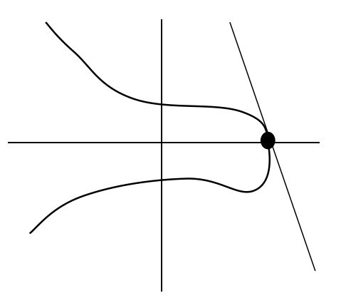 | 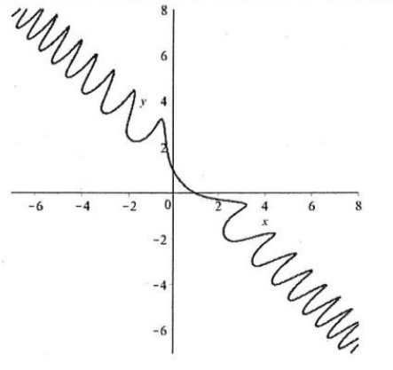 |

For relations like these, there is no way to isolate for either $ x $ or $ y $. Either variable is implicitly defined in the equation in both of the above cases.

---

【Example】If $ x^3 + xy + y^2 = 1 $, find $ dy \over dx $ at the point $ (x, y) = (1, 0) $.
$$
\begin{aligned}
x^3 + xy + y^2 &= 1 \\
3x^2 + (1)y + x({dy \over dx}) + 2y({dy \over dx}) &= 0 \\
{dy \over dx}(x + 2y) &= -3x^2 - y \\
{dy \over dx} &= {-3x^2 - y \over x +2y} \\
			&= {-3(1)^2 - 0 \over 1 + 2(0)} \\
			&= -3
\end{aligned}
$$

【Example】If $ sin(tx^3) + ln(t^2 + x) = 0 $, find $ dx \over dt $.
$$
\begin{aligned}
sin(tx^3) + ln(t^2 + x) &= 0 \\
cos(tx^3)[(1)x^3 + t(3x^2){dx \over dt}] + {1 \over t^2+x}(2t + {dx \over dt}) &= 0 \\
{dx \over dt}[3tx^2cos(tx^3) + {1 \over t^2+x}] &= -x^3cos(tx^3) - {2t \over t^2+x} \\
{dx \over dt} &= {-x^3cos(tx^3) - {2t \over t^2+x} \over 3tx^2cos(tx^3) + {1 \over t^2+x}}
\end{aligned}
$$

【Example】Show that if $ e^{2xy} +e^x + e^y = y $ that $ {dx \over dy} = {1 \over {dy \over dx}} $.
$$
\begin{aligned}
e^{2xy} + e^x + e^y &= y \\
e^{2xy}(2{dx \over dy}y + 2x(1)) + e^x{dx \over dy} + e^y &= 1 \\
{dx \over dy}[2ye^{2xy} + e^x] &= -2xe^{2xy} - e^y + 1 \\
{dx \over dy} &= {-2xe^{2xy} - e^y + 1 \over 2ye^{2xy} + e^x} \\
\\
e^{2xy} + e^x + e^y &= y \\
e^{2xy}(2y + 2x{dy \over dx}) + e^x + e^y{dy \over dx} &= {dy \over dx} \\
{dy \over dx}[2xe^{2xy} + e^y - 1] &= -e^x - 2ye^{2xy} \\
{dy \over dx} &= {-e^x - 2ye^{2xy} \over 2xe^{2xy} + e^y -1} \\
\\
\therefore {dx \over dy} &= {1 \over {dy \over dx}}
\end{aligned}
$$

【Example】If $ x^3 + x = y $, find $ d^2y \over dx^2 $.
$$
\begin{aligned}
x^3 + x &= y \\
3x^2 + 1&= 2y{dy \over dx} \\
{dy \over dx} &= {3x^2 + 1 \over 2y} \\
\\
d^2y \over dx^2 &= {(6x)(2y) - (3x^2+1)(2{dy \over dx}) \over (2y)^2} \\
				&= {12xy - 2(3x^2+1)({3x^2+1 \over 2y}) \over 4y^2} \\
				&= {3x \over y} - {(3x^2+1)^2 \over 4y^3}
\end{aligned}
$$

【Example】A 10m ladder leans against a perpendicular wall.

(a) The top of the ladder slides down the wall at 0.5m/s. How fast is the foot of the ladder moving at the moment the top of the ladder touches the wall 8m above the ground?

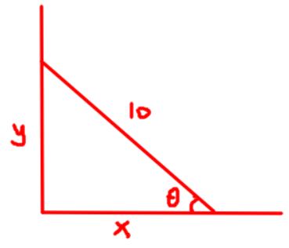

known: $ {dy \over dt} = -0.5, y=8 $
$$
\begin{aligned}
x^2 + 8^2 &= 10^2 \\
x &= 6 \\
\\
x^2 + y^2 &= 10^2 \\
2x{dx \over dt} + 2y{dy \over dt} &= 0 \\
2(6){dx \over dt} + 2(8)(0.5) &= 0 \\
{dx \over dt} &= {2 \over 3}m/s
\end{aligned}
$$

(b) Consider the angle that the ladder makes with the ground. How fast is this angle changing at that exact moment?

want: $ d\theta \over dt $

$$
\begin{aligned}
cos(\theta) &= {x \over 10} \\
-sin(\theta){d\theta \over dt} &= {1 \over 10}{dx \over dt} \\
-{4 \over 5}{d\theta \over dt} &= {1 \over 10} \cdot {2 \over 3} \\
{d\theta \over dt} &= -{1 \over 12}radians/s
\end{aligned}
$$

## 4.6 Logarithmic Differentiation

**Logarithmic Differentiation**

Logarithmic differentiation allows us to take the derivatives of more complicated expressions. The derivative rules give us a way to quickly differentiate expression like $x^5$, $e^{4x}$, $ 2^x $. But what about $x^x$?

---

【Example】Use a table of values to sketch the function $ f(x) = x^x $.

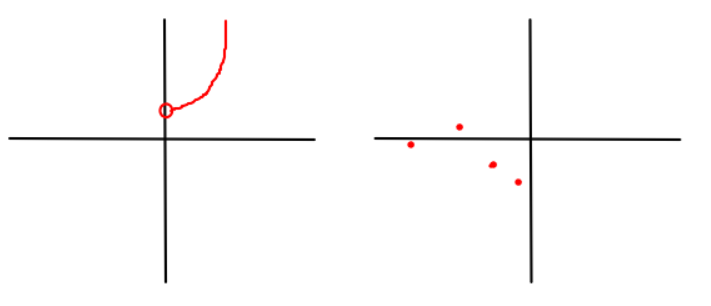

| $ x < 0 $ | $ f(x) $  | $ x > 0 $  |  $ f(x) $   |
| :-------: | :-------: | :--------: | :---------: |
|   $ 1 $   |   $ 1 $   |   $ -1 $   |   $ -1 $    |
|   $ 2 $   |   $ 4 $   |   $ -2 $   | $ -1 / 4 $  |
|   $ 3 $   |  $ 27 $   |   $ -3 $   | $ -1 / 27 $ |
| $ 1 / 2$  | $ 0.707 $ | $ -1 / 3 $ |  $ -1.44 $  |

$ x^x $ is indeterminate when $ x = 0 $. Because the domain of $ x^x $ is extremely complicated when $ x < 0 $, this function is often only considered for $ x > 0 $.

So, how do we determine the derivative of this function? With logarithmic differentiation, we take the ln() of both side. Then we use log rules to simplify what we get before we finish by differentiating implicitly.

---

【Example】If $ y = x^x $, find $ dy \over dx $.
$$
\begin{aligned}
y &= x^x \\
ln(y) &= xln(x) \\
{1 \over y} \cdot {dy \over dx} &= (1)ln(x) + x({1 \over x}) \\
{dy \over dx} &= y[ln(x) + 1] \\
{dy \over dx} &= x^x[ln(x) + 1]
\end{aligned}
$$

【Example】If $ y = (cos(\pi x))^{2x} $, find $  dy \over dx $.
$$
\begin{aligned}
y &= (cos(\pi x))^{2x} \\
ln(y) &= 2x \cdot ln(cos(\pi x)) \\
{1 \over y} \cdot {dy \over dx} &= 2ln(cos(\pi x)) + 2x({1 \over cos(\pi x)})(-sin(\pi x))\pi \\
{dy \over dx} &= (cos(\pi x))^{2x}[2ln(cos(\pi x)) - 2\pi x({sin(\pi x) \over cos(\pi x)})]
\end{aligned}
$$
It would be tedious to differentiate expression like $ y = {(x-2)^2(3x+1)^3\sqrt{x^2+2} \over (x-1)(x+10)^{10}} $ using product and quotient rules, and put pus at a high risk for making mistakes. We can use logarithms to simplify problems. It is technically an important step that we take the absolute value of both sides first that we aren’t considering the $ ln() $ of a negative number.

---

【Example】If $ y = {(x-2)^2(3x+1)^3\sqrt{x^2+2} \over (x-1)(x+10)^{10}} $, find $ dy \over dx $.
$$
\begin{aligned}
y &= {(x-2)^2(3x+1)^3\sqrt{x^2+2} \over (x-1)(x+10)^{10}} \\
ln|y| &= ln|{(x-2)^2 (3x+1)^3 \sqrt{x^2+2} \over (x-1) (x+1)^{10}}| \\
ln|y| &= ln|(x-2)^2| + ln|(3x+1)^3| + ln|(x^2+3)^{1/2}| - ln|x-1| - ln|(x+1)^{10}| \\
ln|y| &= 2ln|x-2| + 3ln|3x+1| + {1 \over 2}ln|x^2+3| - ln|x-1| - 10ln|x+1| \\
{1 \over y} \cdot {dy \over dx} &= {2 \over x-2} + {3 \over 3x+1}(3) + {1 \over 2} \cdot {2x \over x^2+3} - {1 \over x-1} - {10 \over x+1} \\
{dy \over dx} &= {(x-2)^2(3x+1)^3\sqrt{x^2+2} \over (x-1)(x+10)^{10}}({2 \over x-2} + {9 \over 3x+1} + {x \over x^2+3} - {1 \over x-1} - {10 \over x+1})
\end{aligned}
$$

## 4.7 Differential Approximation

**Differential Approximation**

Differential approximation allows us to calculate estimates if numbers that would be impossible to find by hand. For example, we know what $ sin(\pi) $ is, but what about $ sin(3) $?

The idea is simple. Given a function $ f(x) $ and a difficult-to-evaluate value of $ x = a $, we want to follow this process to estimate $  f(a) $:

1. Find a nearby value $ a^* $ at which $ f $ is easy to calculate.
2. Find the tangent line there, called $ L(x) $, with slope $ f'(a^*) $.
3. Estimate $ f(a) $ by using the height $ L(a) $ instead.

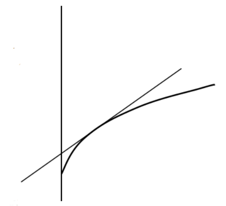

【Example】Estimate $ sin(3) $ using differential approximation.

1. Let $ f(x) = sin(x) $, and the nearby value $ a^* = \pi $.

    Then $ f'(x) = cos(x) $, so $ f'(a^*) = cos(\pi) = -1 $.

2. Now, find the equation of the tangent line to $ f $ at the nearby value $ \pi $.

    $$
    \begin{aligned}
    L(x) &= mx + b \\
    	&= (-1)x + b \\
    0 &= -\pi + b \\
    b &= \pi \\
    \therefore L(x) &= -x + \pi
    \end{aligned}
    $$

3. Calculate the estimate of $ f(a) = f(3) $ using $ L(a) = L(3) $ instead.
    $$
    L(3) = -3 + \pi \approx 0.14159265
    $$

4. True value of $ sin(3) = 0.14112 $.

---

【Example】Estimate $ \sqrt{65} $ using differential approximation.
$$
\begin{aligned}
f(x) &= \sqrt{x}, a^* = 64 \\
f(64) &= \sqrt{64} = 8 \\
\\
f'(x) &= {1 \over 2\sqrt{x}} \\
f'(64) &= {1 \over 2\sqrt{64}} = {1 \over 16} \\
\\
L(x) = mx + b &= {1 \over 16}x + b \\
			8 &= {1 \over 16}(64) + b \\
			b &= 4\\
\\
\therefore L(x) &= {1 \over 16}x +4 \\
L(65) &= {1 \over 16}(65) + 4 \\
	&= 8.0625
\end{aligned}
$$

# Chapter 5 Antiderivatives

## 5.1 The Indefinite Integral

**The Indefinite Integral**

How do we undo a derivative? If we were given the derivative of a function $ f'(x) $, how could we find the original function $ f(x) $? The answer is called the antiderivative of $ f(x) $, which we will denote by the associated capital letter $ F(x) $.

Another way to think about this question is: "What function do I have to take the derivative of in order to get the answer?" The antiderivative of $ f(x) = 2x $ is $ x^2 $.

But what about $ F(x) = x^2 + 1 $? This works too! In fact, since when we take the derivative of a constant, we get zero. We could have chosen any constant. As a result, we report our antiderivative in its most general form $ x^2 + C $. The constant $ C $ is an important part of the antiderivative.

Notationally, we denote the operation of take the antiderivative (known as integration) as:
$$
\int 2x \ dx = x^2 + C
$$
This is also called the indefinite integral of the function $ f(x) $, or sometimes just the integral of $ f(x) $, where $ f(x) $ is called the integrand.

That was a pretty simple example, so how do we find antiderivatives of more complicated expressions? In much the same way as we did with derivatives, we can generate a set of rules for finding antiderivatives, derived simply by thinking of our familiar derivative rules in reverse.

**Basic Antiderivative Rules**

The power rule for derivatives multiplies by the power and then subtracts one from the power. Reversing these operations means that we add one to the power and divide by the new power.

1. Reverse Power Rule
    $$
    \int x^n \ dx = {x^{n+1} \over n+1} + C,\ where\ n \ne -1
    $$
    ---

    【Example】Find the anitiderivatives.
    
    (a)
    $$
    \begin{aligned}
    & \int x^6 \ dx \\
    &= {x^7 \over 7} + C
    \end{aligned}
    $$
    
    
    (b)
    $$
    \begin{aligned}
    & \int \sqrt[4]{t} \ dt \\
    &= \int t^{1 \over 4} \ dt \\
    &= {t^{5/4} \over {5/4}} + C \\
    &= {4t^{5/4} \over 5} + C
    \end{aligned}
    $$
    
    
    (c)
    $$
    \begin{aligned}
    & \int {1 \over x^{5/3}} \ dx \\
    &= \int x^{-{5 \over 3}} \ dx \\
    &= {x^{-2/3} \over -2/3} + C \\
    &= -{3 \over 2x^{2/3}} + C
    \end{aligned}
    $$
    
    
2. Antiderivative of Zero
    $$
    \int 0 \ dx = C
    $$
    
    
3. Antiderivative of a Constant
    $$
    \int k \ dx = kx + C,\ where\ k\ is\ any\ constant
    $$
    ---
    
    【Example】Find the anitiderivatives.
    $$
    \begin{aligned}
    & \int \pi \ dx \\
    &= \pi x + C
    \end{aligned}
    $$
    
    
4. Multiplicative Constants
    $$
    \int kf(x) \ dx = k \int f(x) \ dx
    $$
    ---

    【Example】Find the anitiderivatives.
    
    (a)
    $$
    \begin{aligned}
    & \int 4x^7 \ dx \\
    &= 4 \int x^7 \ dx \\
    &= 4({x^8 \over 8} + C) \\
    &= {x^8 \over 2} + C
    \end{aligned}
    $$
    
    
    (b)
    $$
    \begin{aligned}
    & \int {\pi \over \sqrt{t}} \ dt \\
    &= \pi \int t^{-{1 \over 2}} \ dt \\
    &= \pi \cdot {t^{1/2} \over 1/2} + C \\
    &= 2\pi t^{1/2} + C
    \end{aligned}
    $$
    
5. Sum / Difference
    $$
    \int (f(x) \pm g(x)) \ dx = \int f(x) \ dx \pm \int g(x) \ dx
    $$
    ---

    【Example】Find the anitiderivatives.
    
    (a)
    $$
    \begin{aligned}
    & \int (3x^2 + 5) \ dx \\
    &= {3x^3 \over 3} + 5x + C \\
    &= x^3 + 5x + C
    \end{aligned}
    $$
    
    
    (b)
    $$
    \begin{aligned}
    & \int ({1 \over x^3} - {2 \over x^2}) \ dx \\
    &= \int (x^{-3} - 2x^{-2}) \ dx \\
    &= {x^{-2} \over -2} - 2({x^{-1} \over -1}) + C \\
    &= -{1 \over 2x^2} + {2 \over x} + C
    \end{aligned}
    $$
    
    
6. Trigonometric Functions
    $$
    \begin{aligned}
    \int sin(x) \ dx &= -cos(x) + C \\
    \int cos(x) \ dx &= sin(x) + C \\
    \int csc^2(x) \ dx &= -cot(x) + C \\
    \int sec^2(x) \ dx &= tan(x) + C \\
    \int sec(x)tan(x) \ dx &= sec(x) + C \\
    \int csc(x)cot(x) \ dx &= -csc(x) + C
    \end{aligned}
    $$

7. Exponential / Logarithmic
    $$
    \begin{aligned}
    \int a^xln(a) \ dx &= a^x + C \\
    \int e^xln(e) \ dx &= e^x + C \\
    \int {1 \over xln(a)} \ dx &= log_a|x| + C \\
    \int {1 \over x} \ dx &= ln|x| + C
    \end{aligned}
    $$
    ---

    【Example】Find the anitiderivatives.
    
    (a)
    $$
    \begin{aligned}
    & \int 4^xln(4) + 5e^x - {6 \over x} \ dx \\
    &= 4^x + 5e^x - 6ln|x| + C
    \end{aligned}
    $$
    
    
    (b)
    $$
    \begin{aligned}
    & \int 3^z \ dz \\
    &= {1 \over ln(3)} \int 3^zln(3) \ dz \\
    &= {1 \over ln(3)} \cdot 3^z + C
    \end{aligned}
    $$

---

Sometimes we need to manipulate the integral a little bit before we can apply the rules.

---

【Example】Find the anitiderivatives.

(a)
$$
\begin{aligned}
& \int {2s^3 - 5s^4 \over 3s^2} \ ds \\
&= \int {2 \over 3}s - {5 \over 3}s^2 \ ds \\
&= {2 \over 3} \cdot {s^2 \over 2} - {5 \over 3} \cdot {s^3 \over 3} + C \\
&= {s^2 \over 3} - {5s^3 \over 9} + C
\end{aligned}
$$

(b)
$$
\begin{aligned}
& \int ({1 \over x} + {1 \over x^2})(3 + 2x^2) \ dx \\
&= \int {3 \over x} + 2x + {3 \over x^2} + 2 \ dx \\
&= 3ln|x| + x^2 + 3 \cdot {x^{-1} \over -1} + 2x + C \\
&= 3ln|x| + x^2 + {3 \over x} + 2x + C
\end{aligned}
$$

## 5.2 Chain Rule in Reverse

**Chain Rule in Reverse**

The derivative of $ f(u(x)) $ is $ f'(u(x))u'(x) $, so
$$
\int f'(u(x))u'(x) \ dx = f(u(x)) + C
$$
Notice that in the integration, the $ u'(x) $ piece disappears, being absorbed back into $ f(x) $. The steps for finding the antiderivative of composition functions are as follows:

1. Identify the core layer $ u(x) $.
2. Identify the derivative of the core layer $ u'(x) $.
3. Identify the outer layer $ f' $, and integrate $ f' $ leaving $ u(x) $inside.

---

【Example】Find the anitiderivatives.

(a)
$$
\begin{aligned}
& \int (6x^2 + 1)sin(2x^3 + x) \ dx \\
\\
& u = 2x^3 + x \\
& u' = 6x^2 + 1 \\
\\
& \int (6x^2 + 1)sin(2x^3 + x) \ dx \\
&= -cos(2x^3 + x) + C
\end{aligned}
$$

(b)
$$
\begin{aligned}
& \int sec^2(4t) \ dt \\
& u = 4t \\
& u' = 4 \\
\\
& \int sec^2(4t) \ dt \\
&= {1 \over 4} \int 4sec^2(4t) \ dt \\
&= {1 \over 4}tan(4t) + C
\end{aligned}
$$

(c)
$$
\begin{aligned}
& \int 4x^3(3x^4 - 1)^{14} \ dx \\
\\
& u = 3x^4 - 1 \\
& u' = 12x^3 \\
\\
& \int 4x^3(3x^4 - 1)^{14} \ dx \\
&= {1 \over 3} \int 12x^3(3x^4 - 1)^14 \ dx \\
&= {1 \over 3} \cdot {(3x^4 - 1)^{15} \over 15} + C \\
&= {(3x^4 - 1)^{15} \over 45} + C
\end{aligned}
$$

(d)
$$
\begin{aligned}
& \int {e^{1 \over x} \over 4x^2} \ dx \\
\\
& u = {1 \over x} \\
& u' = -{1 \over x^2} \\
\\
& \int {e^{1 \over x} \over 4x^2} \ dx \\
&= {1 \over 4} \int {1 \over x^2}e^{1 \over x} \ dx \\
&= -{1 \over 4} \int -{1 \over x^2}e^{1 \over x} \ dx \\
&= -{1 \over 4}e^{1 \over x} + C
\end{aligned}
$$

【Example】Integrate in one step.
$$
\begin{aligned}
& \int e^{-2t} + sin(3t) + cos({1 \over 4}t) \ dt \\
&= -{1 \over 2}e^{-2t} - {1 \over 3}cos(3t) + 4sin({1 \over 4}t) + C
\end{aligned}
$$

## 5.3 The Method of Substitution

**The Method of Substitution**

The idea behind the method of substitution is to change a difficult integral in terms of one variable into an easier integral in terms of some other variable using a substitution.
$$
\int f'(u(x)) \ {du \over dx} = \int f'(u) \ du
$$
---

【Example】The method of substitution.
$$
\int (6x + 4)(3x^2 + 4x)^5 \ dx
$$
Step 1: identify the core layer $ u(x) = 3x^2 +4x $.

Step 2: find the derivative of the core $ {du \over dx} = 6x + 4 $.

Step 3: transform from an integral in $ x $ to an integral in the new variable $ u $ using the change of variable theorem.
$$
\begin{aligned}
& \int (6x + 4)(3x^2 + 4x)^5 \ dx \\
&= \int {du \over dx}u^5 \ dx \\
&= \int u^5 \ du \\
&= {u^6 \over 6} + C
\end{aligned}
$$
Step 4: convert back to the original variable by substituting $ u(x) $ back in.
$$
\begin{aligned}
& {u^6 \over 6} + C \\
&= {(3x^2 + 4x)^6 \over 6} + C
\end{aligned}
$$

【Example】Calculate using the method of substitution.

(a)
$$
\int sin(x)e^{5cos(x)} \ dx \\
\\
\begin{aligned}
u &= 5cos(x) \\
{du \over dx} &= -5sin(x) \\
-{1 \over 5} \cdot {du \over dx} &= sin(x) \\
\\
\end{aligned}
\\
\begin{aligned}
& \int sin(x)e^{5cos(x)} \ dx \\
&= \int -{1 \over 5} \cdot {du \over dx}e^u \ dx \\
&= \int -{1 \over 5}e^u \ du \\
&= -{1 \over 5}e^u + C \\
&= -{1 \over 5}e^{5cos(x)} + C
\end{aligned}
$$

(b)
$$
\int {x \over (5x + 7)^3} \ dx \\
\\
\begin{aligned}
u &= 5x + 7 \rarr x = {1 \over 5}{u - 7} \\
{du \over dx} &= 5 \\
{1 \over 5} \cdot {du \over dx} &= 1 \\
\\
\end{aligned}
\\
\begin{aligned}
& \int {x \over (5x + 7)^3} \ dx \\
&= \int {x \cdot 1 \over (5x+7)^3} \ dx \\
&= \int{{1 \over 5}(u - 7) \over u^3}({1 \over 5} \cdot {du \over dx}) \ dx \\
&= {1 \over 25} \int {u - 7 \over u^3} \ du \\
&= {1 \over 25} \int u^{-2} - 7u^{-3} \ du \\
&= {1 \over 25}({u^{-1} \over -1} - {{7u^{-2} \over -2}}) + C \\
&= -{1 \over 25} \cdot {1 \over 5x+7} + {7 \over 50} \cdot {1 \over (5x+7)^2} + C
\end{aligned}
$$

(c)
$$
\int xsec(3x^2)tan(3x^2) \ dx \\
\\
\begin{aligned}
u &= 3x^2 \\
u' &= 6x \\
\\
\end{aligned}
\\
\begin{aligned}
& \int xsec(3x^2)tan(3x^2) \ dx \\
&= {1 \over 6} \int 6xsec(3x^2)tan(3x^2) \ dx \\
&= {1 \over 6}sec(3x^2) + C
\end{aligned}
$$

(d)
$$
\int {-{1 \over t^2} + 1 \over \sqrt{{1 \over t} + t}} \ dt \\
\\
\begin{aligned}
u &= {1 \over t} + t \\
u' &= -{1 \over t^2} + 1 \\
\\
\end{aligned}
\\
\begin{aligned}
& \int {-{1 \over t^2} + 1 \over \sqrt{{1 \over t} + t}} \ dt \\
&= \int (-{1 \over t^2} + 1)({1 \over t} + t)^{-{1 \over 2}} \ dt \\
&= {({1 \over t} +t)^{1/2} \over 1/2} + C \\
&= 2({1 \over t} + t)^{1/2} + C
\end{aligned}
$$

(e)
$$
\int (1 + 900x)^{1/15000} \ dx \\
\\
\begin{aligned}
u &= 1 + 900x \\
u' &= 900 \\
\\
\end{aligned}
\\
\begin{aligned}
& \int (1 + 900x)^{1/15000} \ dx \\
&= {1 \over 900} \int 900(1 + 900x)^{1/15000} \ dx \\
&= {1 \over 900} \cdot {(1+900x)^{15001/15000} \over 15001/15000} + C
\end{aligned}
$$

(f)
$$
\begin{aligned}
& \int sin(\theta)(cos^3\theta - cos^5\theta) \ d\theta \\
&= \int sin(\theta)cos(\theta)^3 - sin(\theta)cos(\theta)^5 \ d\theta \\
&= -{cos^4\theta \over 4} + {cos^6\theta \over 6} + C
\end{aligned}
$$

(g)
$$
\int {7x \over 4x^2 + 9} \ dx \\
\\
\begin{aligned}
u &= 4x^2 + 9 \\
u' &= 8x \\
\\
\end{aligned}
\\
【*】\int {u'(x) \over u(x)} \ dx = ln|u(x)| + C \\
\\
\begin{aligned}
& \int {7x \over 4x^2 + 9} \ dx \\
&= {7 \over 8} \int {8x \over 4x^2 + 9} \ dx \\
&= {7 \over 8} \cdot ln|4x^2 + 9| + C \\
&= {7 \over 8} \cdot kn(4x^2 + 9) + C
\end{aligned}
$$

(h)
$$
\int (2x + 5) \cdot \sqrt[3]{3x + 1} \ dx \\
\\
\begin{aligned}
u &= 3x + 1 \\
{1 \over 3}(u - 1) &= 1 \\
{1 \over 3}u - {1 \over 3} &= x \\
{2 \over 3}u - {2 \over 3} &= 2x \\
{2 \over 3}u 0 {2 \over 3} + 5 &= 2x + 5 \\
{2 \over 3}u + {13 \over 3} &= 2x + 5 \\
{1 \over 3}(2u + 13) &= 2x + 5 \\
\end{aligned}
\\
\\
\begin{aligned}
u &= 3x + 1 \\
{du \over dx} &= 3 \\
{1 \over 3} \cdot {du \over dx} &= 1 \\
\end{aligned}
\\
\\
\begin{aligned}
& \int (2x + 5) \cdot \sqrt[3]{3x + 1} \ dx \\
&= \int {1 \over 3}(2u + 13) \sqrt[3]{u} {1 \over 3} \cdot {du \over dx} \\
&= {1 \over 9} \int (2u + 13) u^{1/3} \ du \\
&= {1 \over 9}(2 \cdot {u^{7/3} \over {7/3}} + 13 \cdot {u^{4/3} \over {4/3}}) + C \\
&= {2 \over 21}(3x + 1)^{7/3} + {13 \over 12}(3x + 1)^{4/3} + C
\end{aligned}
$$

## 5.4 Definite Integrals

**Riemann Sum**

Suppose we wanted to find the area underneath the graph of a straight line that lies above the x-axis, between $ x = a $ and $  x = b $. Since we have formulas for finding the area of basic shapes, we can easily figure this out.

But what about finding the area underneath the graph of a general curve $ y = f(x) $ and above the x-axis between $  x = a $ and $ x = b $?

Bernhard Riemann’s idea was to carve up the desired area into rectangle and user their area to estimate the true area. He called this the Riemann Sum and it goes as follows:

1. Create a partition $ P $, dividing up the interval $ [a, b] $ into n subintervals $ I_1, I_2, \dots, I_n $.
2. Choose an x-value (called it $ x_k $) in each subinterval $ I_k $.
3. For each $ x_k $ we choose, draw a rectangle with height $ f(x_k) $ and a width spanning $ I_k $ ($ \Delta x_k $).

The area of rectangle k is:
$$
f(x_k) \cdot \Delta x_k
$$
The total area of all the rectangles is:
$$
f(x_1) \cdot \Delta x_1 + f(x_2) \cdot \Delta x_2 + \dots + f(x_n) \cdot \Delta x_n = \sum_{k=1}^{n} f(x_k) \cdot \Delta x_k
$$
---

【Example】Use the Riemann Sum to estimate the area below $ y = sin({1 \over 2}x) $ and above the x-axis, between $ x = 0 $ and $ x = 2\pi $. Use a partition of 4 subintervals.

$$
\Delta x_k = {2 \pi \over 4} = {\pi \over 2} \\
\\
\begin{aligned}
Area &= ({\pi \over 2})(sin({1 \over 2} \cdot {{\pi \over 2}})) + ({\pi \over 2})(sin({1 \over 2} \cdot \pi)) + ({\pi \over 2})(sin({1 \over 2} \cdot {3 \pi \over 2})) + 0 \\
	&= {\pi \over 2}({1 \over \sqrt{2}} + 1 + {1 \over \sqrt{2}}) \\
	&= {1 \over 2}({2 \over \sqrt{2}} + 1) \ unit^2
\end{aligned}
$$
---

So, what happens as make the rectangles skinnier?

As the width of the rectangles decreases, the accuracy of the estimate increases. So, what happens if we let the width of all the rectangles in the partition approach 0?

Notationally:
$$
\lim\limits_{n \rarr \infin, \ ||p|| \rarr 0} \sum_{k=1}^{n} f(x_k) \cdot \Delta x_k \\
$$
We should get the exact area, that is, our estimate is no longer just an estimate.

Notationally, instead of limit, we write it as:
$$
\int_{x = a}^{b} f(x) \ dx
$$

**Definite Integral**

For all of the following, suppose that $ k $, $ a $, $ b $, and $ c $ are constants with $ a < b < c $, and that $ f $ and $ g $ are integrable functions on the domain of integration.

| Formula                                                      |                            Graph                             |
| :----------------------------------------------------------- | :----------------------------------------------------------: |
| $$ \begin{aligned} & \int_a^b k \ dx \\ &= (b - a)k \end{aligned} $$ |   |
| $$ \begin{aligned} & \int_a^a f(x) \ dx \\ &= 0 \end{aligned} $$ |   |
| $$ \begin{aligned} & \int_b^a f(x) \ dx \\ &= -\int_a^b f(x) \ dx \end{aligned} $$ |   |
| $$ \begin{aligned} & \int_a^c f(x) \ dx \\ &= \int_a^b f(x) \ dx + \int_b^c f(x) \ dx \end{aligned} $$ |   |
| $$ \begin{aligned} & \int_a^b kf(x) \ dx \\ &= k \int_a^b f(x) \ dx \end{aligned} $$ |   |
| $$ \begin{aligned} & \int_a^b (f(x) \pm g(x))  \ dx \\ &= \int_a^b f(x) \ dx \pm \int_a^b g(x) \ dx \end{aligned} $$ |  |

【Example】Evaluate.

(a)
$$
\begin{aligned}
& \int_1^2 {1 \over t} \ dt \\
&= \left. \lbrack ln|t| \right|_{t=1}^{2} \\
&= ln(2) - ln(1) \\
&= ln(2)
\end{aligned}
$$

(b)
$$
\begin{aligned}
& \int_{-2}^1 x^3 \ dx \\
&= \left. {x^4 \over 4} \right|_{-2}^1 \\
&= {1^4 \over 4} - {(-2)^4 \over 4} \\
&= {1 \over 4} - {16 \over 4} \\
&= -{15 \over 4}
\end{aligned}
$$

(c)
$$
\begin{aligned}
& \int_1^5 s(s^2 + 1) \ ds \\
&= \int_1^5 s^3 + s \ ds \\
&= \left. \lbrack {s^4 \over 4} + {s^2 \over 2} \right|_1^5 \\
&= ({5^2 \over 4} + {5^2 \over 2}) - ({1^2 \over 4} + {1^2 \over 2}) \\
&= {625 \over 4} + {25 \over 2} - {1 \over 4} - {1 \over 2} \\
&= 168
\end{aligned}
$$

(d)
$$
\int_{\sqrt{ln(2)}}^{\sqrt{ln(4)}} xe^{x^2} \ dx \\
\\
\begin{aligned}
u &= x^2 \\
u' &= 2x \\
\end{aligned}
\\
\\
\begin{aligned}
& \int_{\sqrt{ln(2)}}^{\sqrt{ln(4)}} xe^{x^2} \ dx \\
&= {1 \over 2} \int_{\sqrt{ln(2)}}^{\sqrt{ln(4)}} 2xe^{x^2} \ dx \\
&= \left. \lbrack {1 \over 2} e^{x^2} \right|_{\sqrt{ln(2)}}^{\sqrt{ln(4)}} \\
&= {1 \over 2}e^{ln(4)} - {1 \over 2}e^{ln(2)} \\
&= {1 \over 2} \cdot 4 - {1 \over 2} \cdot 2 \\
&= 2 - 1 \\
&= 1
\end{aligned}
$$

(e)
$$
\begin{aligned}
& \int_x^{x^2} sin(t) \ dt \\
&= \left \lbrack -cos(t) \right|_x^{x^2} \\
&= -cos(x^2) - (-cos(x)) \\
&= -cos(x^2) + cos(x)
\end{aligned}
$$

(f)
$$
\int_5^{13} (x + 1)\sqrt{2x - 1} \ dx \\
\\
\begin{aligned}
u &= 2x - 1 \\
u + 1 &= 2x \\
{u \over 2} + {1 \over 2} &= x \\
{1 \over 2}u + {3 \over 2} &= x + 1 \\
{1 \over 2}(u + 3) &= x + 1 \\
\end{aligned}
\\
\\
\begin{aligned}
u &= 2x - 1 \\
{du \over dx} &= 2 \\
{1 \over 2} \cdot {du \over dx} &= 1 \\
\end{aligned}
\\
\\
\begin{aligned}
& \int_5^{13} (x + 1)\sqrt{2x - 1} \ dx \\
&= \int_5^{13} {1 \over 2}(u + 3)\sqrt{u} \cdot {1 \over 2} \cdot {du \over dx} \ dx \\
&= {1 \over 4} \int_5^{13} (u + 3)u^{1/2} \ du \\
&= {1 \over 4} \int_5^{13} u^{3/2} + 3u^{1/2} \ du \\
&= {1 \over 4} \left. \lbrack {(2x-1)^{5/2} \over {5/2}} + {3(2x-1)^{3/2} \over {3/2}} \right|_5^{13} \\
&= {1 \over 4} \lbrack {{{25^{5/2}} \over {5/2}} + 3 \cdot {{25^{3/2}} \over {3/2}} - {9^{5/2} \over {5/2}} - 3 \cdot {9^{3/2} \over {3/2}}} \rbrack \\
&= 10 \cdot 3125 + {1 \over 2} \cdot 125 - {1 \over 10} \cdot 243 - {27 \over 2} \\
&= {1686 \over 5}
\end{aligned}
$$

## 5.5 Area Under a Curve

**Area Under a Curve**

【Example】Find the area below the curve $ f(x) = sin(x) $ and above the x-axis between $ x = {\pi \over 2} $ and $ x = \pi $.

$$
\begin{aligned}
Area &= \int_{x={\pi / 2}}^\pi sin(x) \ dx \\
	&= - \left. \lbrack cos(x) \right|_{\pi / 2}^\pi \\
	&= - \lbrack cos(\pi) - cos({\pi \over 2}) \rbrack \\
	&= -[-1 - 0] \\
	&= 1
\end{aligned}
$$
---

What if we have a more interesting situation where many curves are involved? For instance, how do we find the area between two curves $ f $ and $ g $?

【Example】Calculate the area bounded by $ y = 2x + 1 $ and $ y = x^2 - 2x - 3 $.

$$
2x + 1 = x^2 - 2x - 3 \\
x^2 - 4x - 5 = 0 \\
(x - 5)(x + 1) = 0 \\
x_1 = 5,\ x_2 = -1 \\
\\
\begin{aligned}
Area &= Upper - Lower \\
	&= \int_{-1}^5 (2x + 1) - (x^2 - 2x - 3) \ dx \\
	&= \int_{-1}^5 -x^2 + 4x + 5 \ dx \\
	&= \left. \lbrack -{x^3 \over 3} + 4 \cdot {x^2 \over 2} + 5x \right|_{-1}^5 \\
	&= -{5^3 \over 3} + 2 \cdot 5^2 + 5 \cdot 5 - ({1 \over 3} + 2 - 5) \\
	&= -{125 \over 3} + {150 \over 3} + {75 \over 3} - {1 \over 3} - {6 \over 3} + {15 \over 3} \\
	&= 36
\end{aligned}
$$

【Example】Calculate the area bounded by $ y = -x $ and $ y = -x^2 + 2 $ between $ x = 0 $ and $ x = 2 $.

$$
\begin{aligned}
Total \ Area &= A_1 + A_2 \\
			&= \int_0^1 \sqrt{x} - (-x) \ dx + \int_1^2 (-x^2 + 2) - (-x) \ dx \\
			&= \int_0^1 x^{1/2} + x \ dx + \int_1^2 -x^2 + x + 2 \ dx \\
			&= \left. \lbrack {{x^{3/2}} \over {3/2}} + {x^2 \over 2} \right|_0^1 + \left. \lbrack -{{x^3} \over 3} + {x^2 \over 2} + 2x \right|_1^2 \\
			&= ({1 \over 3/2} + {1 \over 2}) - (0 + 0) + (-{8 \over 3} + {4 \over 2} + 4) - (-{1 \over 3} + {1 \over 2} + 2) \\
			&= {2 \over 3} + {1 \over 2} - {8 \over 3} + 2 + 4 + {1 \over 3} - {1 \over 2} - 2 \\
			&= {7 \over 3}
\end{aligned}
$$

【Example】Find the area bounded by $ y^2 = x + 4 $ and $ y = {1 \over 2}x + {1 \over 2} $.

$$
\begin{aligned}
y^2 = x + 4 &\rarr x = y^2 - 4 \\
y = {1 \over 2}x + {1 \over 2} &\rarr x = 2y - 1 \\
\\
y^2 - 4 &= 2y - 1 \\
y^2 - 2y - 3 &= 0 \\
(y - 3)(y + 1) &= 0 \\
y_1 = 3 & ,\ y_2 = 01 \\
\\
Area &= \int_{y=-1}^3 (2y - 1) - (y^2 - 4) \ dy \\
	&= \int_{y=-1}^3 -y^2 + 2y + 3 \ dy \\
	&= \left. \lbrack {-{y^3 \over 3} + {2y^2 \over 2} + 3y} \right|_{-1}^3 \\
	&= -{27 \over 3} + 9 + 9 - (-{-1 \over 3} + 1 - 3) \\
	&= {32 \over 3}
\end{aligned}
$$
