【Example】Calculate using the method of substitution.

(a)
$$
\int sin(x)e^{5cos(x)} \ dx \\
\\
\begin{aligned}
u &= 5cos(x) \\
{du \over dx} &= -5sin(x) \\
-{1 \over 5} \cdot {du \over dx} &= sin(x) \\
\\
\end{aligned}
\\
\begin{aligned}
& \int sin(x)e^{5cos(x)} \ dx \\
&= \int -{1 \over 5} \cdot {du \over dx}e^u \ dx \\
&= \int -{1 \over 5}e^u \ du \\
&= -{1 \over 5}e^u + C \\
&= -{1 \over 5}e^{5cos(x)} + C
\end{aligned}
$$

(b)
$$
\int {x \over (5x + 7)^3} \ dx \\
\\
\begin{aligned}
u &= 5x + 7 \rarr x = {1 \over 5}{u - 7} \\
{du \over dx} &= 5 \\
{1 \over 5} \cdot {du \over dx} &= 1 \\
\\
\end{aligned}
\\
\begin{aligned}
& \int {x \over (5x + 7)^3} \ dx \\
&= \int {x \cdot 1 \over (5x+7)^3} \ dx \\
&= \int{{1 \over 5}(u - 7) \over u^3}({1 \over 5} \cdot {du \over dx}) \ dx \\
&= {1 \over 25} \int {u - 7 \over u^3} \ du \\
&= {1 \over 25} \int u^{-2} - 7u^{-3} \ du \\
&= {1 \over 25}({u^{-1} \over -1} - {{7u^{-2} \over -2}}) + C \\
&= -{1 \over 25} \cdot {1 \over 5x+7} + {7 \over 50} \cdot {1 \over (5x+7)^2} + C
\end{aligned}
$$

(c)
$$
\int xsec(3x^2)tan(3x^2) \ dx \\
\\
\begin{aligned}
u &= 3x^2 \\
u' &= 6x \\
\\
\end{aligned}
\\
\begin{aligned}
& \int xsec(3x^2)tan(3x^2) \ dx \\
&= {1 \over 6} \int 6xsec(3x^2)tan(3x^2) \ dx \\
&= {1 \over 6}sec(3x^2) + C
\end{aligned}
$$

(d)
$$
\int {-{1 \over t^2} + 1 \over \sqrt{{1 \over t} + t}} \ dt \\
\\
\begin{aligned}
u &= {1 \over t} + t \\
u' &= -{1 \over t^2} + 1 \\
\\
\end{aligned}
\\
\begin{aligned}
& \int {-{1 \over t^2} + 1 \over \sqrt{{1 \over t} + t}} \ dt \\
&= \int (-{1 \over t^2} + 1)({1 \over t} + t)^{-{1 \over 2}} \ dt \\
&= {({1 \over t} +t)^{1/2} \over 1/2} + C \\
&= 2({1 \over t} + t)^{1/2} + C
\end{aligned}
$$

(e)
$$
\int (1 + 900x)^{1/15000} \ dx \\
\\
\begin{aligned}
u &= 1 + 900x \\
u' &= 900 \\
\\
\end{aligned}
\\
\begin{aligned}
& \int (1 + 900x)^{1/15000} \ dx \\
&= {1 \over 900} \int 900(1 + 900x)^{1/15000} \ dx \\
&= {1 \over 900} \cdot {(1+900x)^{15001/15000} \over 15001/15000} + C
\end{aligned}
$$

(f)
$$
\begin{aligned}
& \int sin(\theta)(cos^3\theta - cos^5\theta) \ d\theta \\
&= \int sin(\theta)cos(\theta)^3 - sin(\theta)cos(\theta)^5 \ d\theta \\
&= -{cos^4\theta \over 4} + {cos^6\theta \over 6} + C
\end{aligned}
$$

(g)
$$
\int {7x \over 4x^2 + 9} \ dx \\
\\
\begin{aligned}
u &= 4x^2 + 9 \\
u' &= 8x \\
\\
\end{aligned}
\\
【*】\int {u'(x) \over u(x)} \ dx = ln|u(x)| + C \\
\\
\begin{aligned}
& \int {7x \over 4x^2 + 9} \ dx \\
&= {7 \over 8} \int {8x \over 4x^2 + 9} \ dx \\
&= {7 \over 8} \cdot ln|4x^2 + 9| + C \\
&= {7 \over 8} \cdot kn(4x^2 + 9) + C
\end{aligned}
$$

(h)
$$
\int (2x + 5) \cdot \sqrt[3]{3x + 1} \ dx \\
\\
\begin{aligned}
u &= 3x + 1 \\
{1 \over 3}(u - 1) &= 1 \\
{1 \over 3}u - {1 \over 3} &= x \\
{2 \over 3}u - {2 \over 3} &= 2x \\
{2 \over 3}u 0 {2 \over 3} + 5 &= 2x + 5 \\
{2 \over 3}u + {13 \over 3} &= 2x + 5 \\
{1 \over 3}(2u + 13) &= 2x + 5 \\
\end{aligned}
\\
\\
\begin{aligned}
u &= 3x + 1 \\
{du \over dx} &= 3 \\
{1 \over 3} \cdot {du \over dx} &= 1 \\
\end{aligned}
\\
\\
\begin{aligned}
& \int (2x + 5) \cdot \sqrt[3]{3x + 1} \ dx \\
&= \int {1 \over 3}(2u + 13) \sqrt[3]{u} {1 \over 3} \cdot {du \over dx} \\
&= {1 \over 9} \int (2u + 13) u^{1/3} \ du \\
&= {1 \over 9}(2 \cdot {u^{7/3} \over {7/3}} + 13 \cdot {u^{4/3} \over {4/3}}) + C \\
&= {2 \over 21}(3x + 1)^{7/3} + {13 \over 12}(3x + 1)^{4/3} + C
\end{aligned}
$$

## 5.4 Definite Integrals

**Riemann Sum**

Suppose we wanted to find the area underneath the graph of a straight line that lies above the x-axis, between $ x = a $ and $  x = b $. Since we have formulas for finding the area of basic shapes, we can easily figure this out.

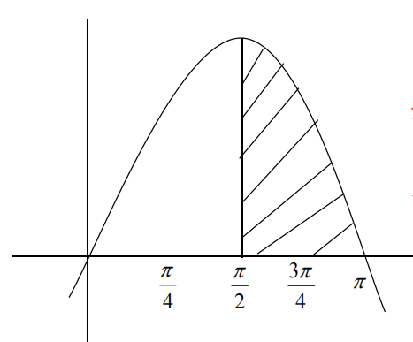

But what about finding the area underneath the graph of a general curve $ y = f(x) $ and above the x-axis between $  x = a $ and $ x = b $?

Bernhard Riemann’s idea was to carve up the desired area into rectangle and user their area to estimate the true area. He called this the Riemann Sum and it goes as follows:

1. Create a partition $ P $, dividing up the interval $ [a, b] $ into n subintervals $ I_1, I_2, \dots, I_n $.
2. Choose an x-value (called it $ x_k $) in each subinterval $ I_k $.
3. For each $ x_k $ we choose, draw a rectangle with height $ f(x_k) $ and a width spanning $ I_k $ ($ \Delta x_k $).

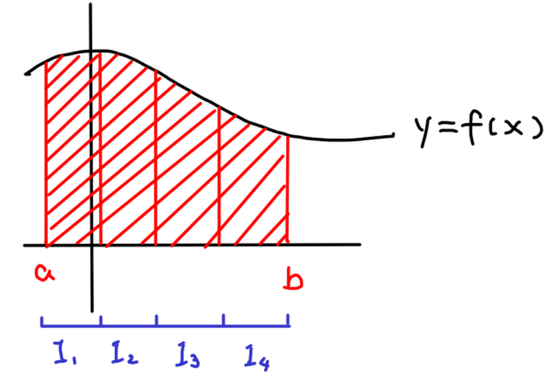

The area of rectangle k is:
$$
f(x_k) \cdot \Delta x_k
$$
The total area of all the rectangles is:
$$
f(x_1) \cdot \Delta x_1 + f(x_2) \cdot \Delta x_2 + \dots + f(x_n) \cdot \Delta x_n = \sum_{k=1}^{n} f(x_k) \cdot \Delta x_k
$$
---

【Example】Use the Riemann Sum to estimate the area below $ y = sin({1 \over 2}x) $ and above the x-axis, between $ x = 0 $ and $ x = 2\pi $. Use a partition of 4 subintervals.

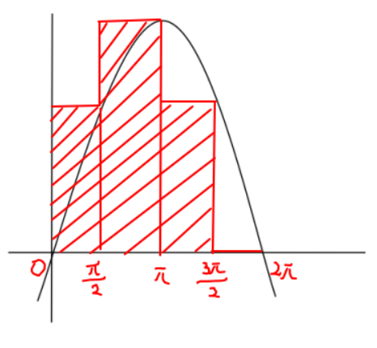
$$
\Delta x_k = {2 \pi \over 4} = {\pi \over 2} \\
\\
\begin{aligned}
Area &= ({\pi \over 2})(sin({1 \over 2} \cdot {{\pi \over 2}})) + ({\pi \over 2})(sin({1 \over 2} \cdot \pi)) + ({\pi \over 2})(sin({1 \over 2} \cdot {3 \pi \over 2})) + 0 \\
	&= {\pi \over 2}({1 \over \sqrt{2}} + 1 + {1 \over \sqrt{2}}) \\
	&= {1 \over 2}({2 \over \sqrt{2}} + 1) \ unit^2
\end{aligned}
$$
---

So, what happens as make the rectangles skinnier?

As the width of the rectangles decreases, the accuracy of the estimate increases. So, what happens if we let the width of all the rectangles in the partition approach 0?

Notationally:
$$
\lim\limits_{n \rarr \infin, \ ||p|| \rarr 0} \sum_{k=1}^{n} f(x_k) \cdot \Delta x_k \\
$$
We should get the exact area, that is, our estimate is no longer just an estimate.

Notationally, instead of limit, we write it as:
$$
\int_{x = a}^{b} f(x) \ dx
$$

**Definite Integral**

For all of the following, suppose that $ k $, $ a $, $ b $, and $ c $ are constants with $ a < b < c $, and that $ f $ and $ g $ are integrable functions on the domain of integration.

| Formula                                                      |                            Graph                             |
| :----------------------------------------------------------- | :----------------------------------------------------------: |
| $$ \begin{aligned} & \int_a^b k \ dx \\ &= (b - a)k \end{aligned} $$ | 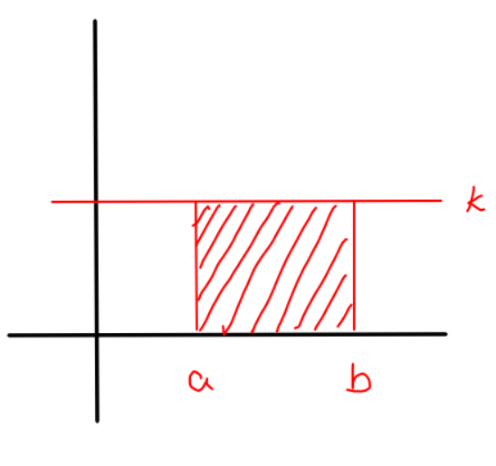  |
| $$ \begin{aligned} & \int_a^a f(x) \ dx \\ &= 0 \end{aligned} $$ | 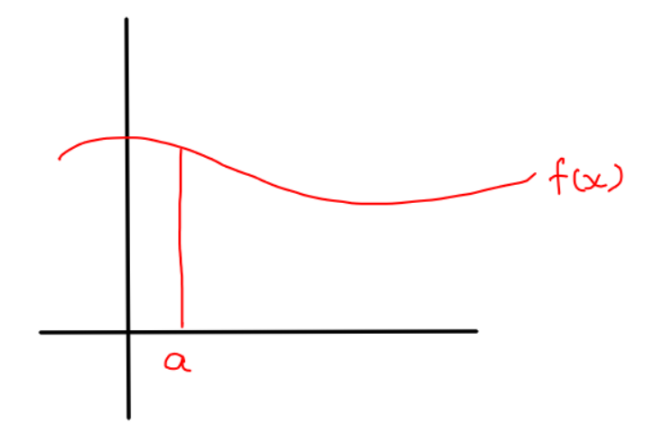  |
| $$ \begin{aligned} & \int_b^a f(x) \ dx \\ &= -\int_a^b f(x) \ dx \end{aligned} $$ | 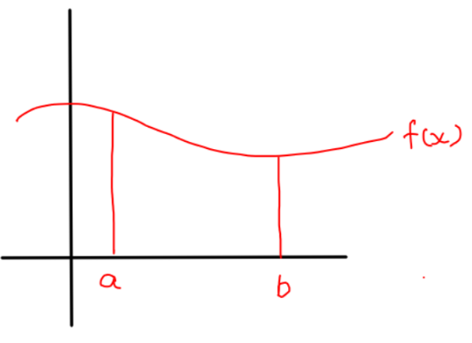  |
| $$ \begin{aligned} & \int_a^c f(x) \ dx \\ &= \int_a^b f(x) \ dx + \int_b^c f(x) \ dx \end{aligned} $$ | 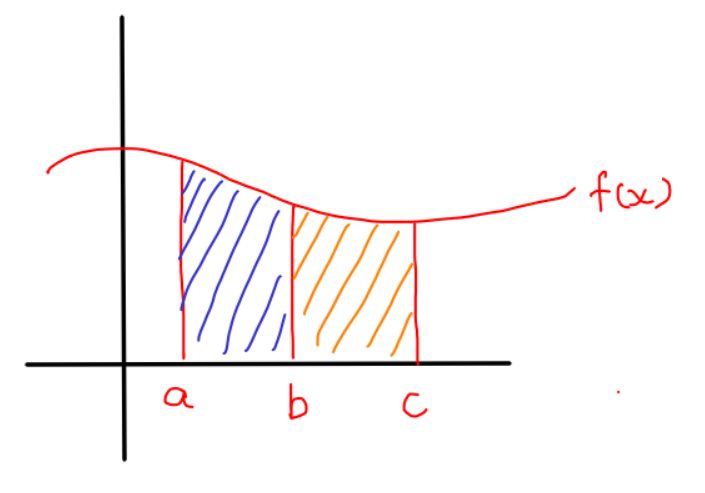  |
| $$ \begin{aligned} & \int_a^b kf(x) \ dx \\ &= k \int_a^b f(x) \ dx \end{aligned} $$ | 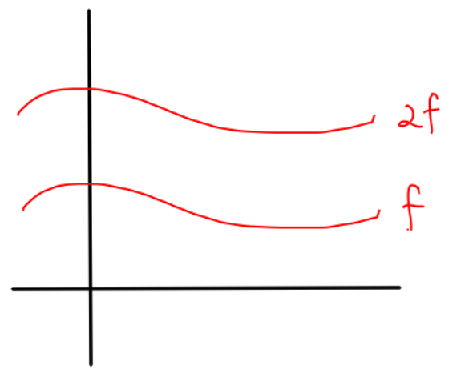  |
| $$ \begin{aligned} & \int_a^b (f(x) \pm g(x))  \ dx \\ &= \int_a^b f(x) \ dx \pm \int_a^b g(x) \ dx \end{aligned} $$ | 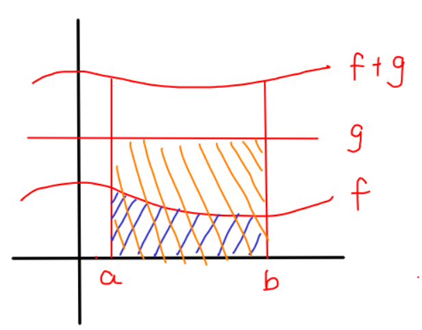 |

【Example】Evaluate.

(a)
$$
\begin{aligned}
& \int_1^2 {1 \over t} \ dt \\
&= \left. \lbrack ln|t| \right|_{t=1}^{2} \\
&= ln(2) - ln(1) \\
&= ln(2)
\end{aligned}
$$

(b)
$$
\begin{aligned}
& \int_{-2}^1 x^3 \ dx \\
&= \left. {x^4 \over 4} \right|_{-2}^1 \\
&= {1^4 \over 4} - {(-2)^4 \over 4} \\
&= {1 \over 4} - {16 \over 4} \\
&= -{15 \over 4}
\end{aligned}
$$

(c)
$$
\begin{aligned}
& \int_1^5 s(s^2 + 1) \ ds \\
&= \int_1^5 s^3 + s \ ds \\
&= \left. \lbrack {s^4 \over 4} + {s^2 \over 2} \right|_1^5 \\
&= ({5^2 \over 4} + {5^2 \over 2}) - ({1^2 \over 4} + {1^2 \over 2}) \\
&= {625 \over 4} + {25 \over 2} - {1 \over 4} - {1 \over 2} \\
&= 168
\end{aligned}
$$

(d)
$$
\int_{\sqrt{ln(2)}}^{\sqrt{ln(4)}} xe^{x^2} \ dx \\
\\
\begin{aligned}
u &= x^2 \\
u' &= 2x \\
\end{aligned}
\\
\\
\begin{aligned}
& \int_{\sqrt{ln(2)}}^{\sqrt{ln(4)}} xe^{x^2} \ dx \\
&= {1 \over 2} \int_{\sqrt{ln(2)}}^{\sqrt{ln(4)}} 2xe^{x^2} \ dx \\
&= \left. \lbrack {1 \over 2} e^{x^2} \right|_{\sqrt{ln(2)}}^{\sqrt{ln(4)}} \\
&= {1 \over 2}e^{ln(4)} - {1 \over 2}e^{ln(2)} \\
&= {1 \over 2} \cdot 4 - {1 \over 2} \cdot 2 \\
&= 2 - 1 \\
&= 1
\end{aligned}
$$

(e)
$$
\begin{aligned}
& \int_x^{x^2} sin(t) \ dt \\
&= \left \lbrack -cos(t) \right|_x^{x^2} \\
&= -cos(x^2) - (-cos(x)) \\
&= -cos(x^2) + cos(x)
\end{aligned}
$$

(f)
$$
\int_5^{13} (x + 1)\sqrt{2x - 1} \ dx \\
\\
\begin{aligned}
u &= 2x - 1 \\
u + 1 &= 2x \\
{u \over 2} + {1 \over 2} &= x \\
{1 \over 2}u + {3 \over 2} &= x + 1 \\
{1 \over 2}(u + 3) &= x + 1 \\
\end{aligned}
\\
\\
\begin{aligned}
u &= 2x - 1 \\
{du \over dx} &= 2 \\
{1 \over 2} \cdot {du \over dx} &= 1 \\
\end{aligned}
\\
\\
\begin{aligned}
& \int_5^{13} (x + 1)\sqrt{2x - 1} \ dx \\
&= \int_5^{13} {1 \over 2}(u + 3)\sqrt{u} \cdot {1 \over 2} \cdot {du \over dx} \ dx \\
&= {1 \over 4} \int_5^{13} (u + 3)u^{1/2} \ du \\
&= {1 \over 4} \int_5^{13} u^{3/2} + 3u^{1/2} \ du \\
&= {1 \over 4} \left. \lbrack {(2x-1)^{5/2} \over {5/2}} + {3(2x-1)^{3/2} \over {3/2}} \right|_5^{13} \\
&= {1 \over 4} \lbrack {{{25^{5/2}} \over {5/2}} + 3 \cdot {{25^{3/2}} \over {3/2}} - {9^{5/2} \over {5/2}} - 3 \cdot {9^{3/2} \over {3/2}}} \rbrack \\
&= 10 \cdot 3125 + {1 \over 2} \cdot 125 - {1 \over 10} \cdot 243 - {27 \over 2} \\
&= {1686 \over 5}
\end{aligned}
$$

## 5.5 Area Under a Curve

**Area Under a Curve**

【Example】Find the area below the curve $ f(x) = sin(x) $ and above the x-axis between $ x = {\pi \over 2} $ and $ x = \pi $.

$$
\begin{aligned}
Area &= \int_{x={\pi / 2}}^\pi sin(x) \ dx \\
	&= - \left. \lbrack cos(x) \right|_{\pi / 2}^\pi \\
	&= - \lbrack cos(\pi) - cos({\pi \over 2}) \rbrack \\
	&= -[-1 - 0] \\
	&= 1
\end{aligned}
$$
---

What if we have a more interesting situation where many curves are involved? For instance, how do we find the area between two curves $ f $ and $ g $?

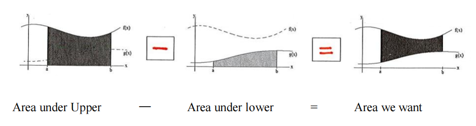

【Example】Calculate the area bounded by $ y = 2x + 1 $ and $ y = x^2 - 2x - 3 $.

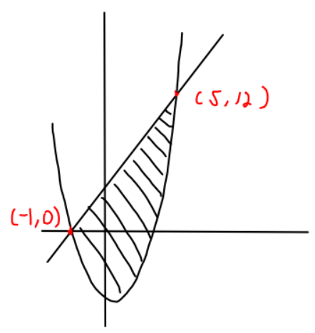
$$
2x + 1 = x^2 - 2x - 3 \\
x^2 - 4x - 5 = 0 \\
(x - 5)(x + 1) = 0 \\
x_1 = 5,\ x_2 = -1 \\
\\
\begin{aligned}
Area &= Upper - Lower \\
	&= \int_{-1}^5 (2x + 1) - (x^2 - 2x - 3) \ dx \\
	&= \int_{-1}^5 -x^2 + 4x + 5 \ dx \\
	&= \left. \lbrack -{x^3 \over 3} + 4 \cdot {x^2 \over 2} + 5x \right|_{-1}^5 \\
	&= -{5^3 \over 3} + 2 \cdot 5^2 + 5 \cdot 5 - ({1 \over 3} + 2 - 5) \\
	&= -{125 \over 3} + {150 \over 3} + {75 \over 3} - {1 \over 3} - {6 \over 3} + {15 \over 3} \\
	&= 36
\end{aligned}
$$

【Example】Calculate the area bounded by $ y = -x $ and $ y = -x^2 + 2 $ between $ x = 0 $ and $ x = 2 $.

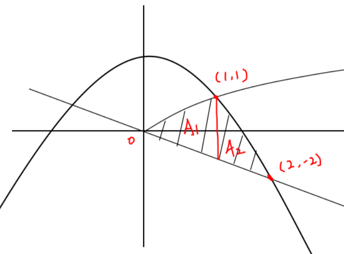

$$
\begin{aligned}
Total \ Area &= A_1 + A_2 \\
			&= \int_0^1 \sqrt{x} - (-x) \ dx + \int_1^2 (-x^2 + 2) - (-x) \ dx \\
			&= \int_0^1 x^{1/2} + x \ dx + \int_1^2 -x^2 + x + 2 \ dx \\
			&= \left. \lbrack {{x^{3/2}} \over {3/2}} + {x^2 \over 2} \right|_0^1 + \left. \lbrack -{{x^3} \over 3} + {x^2 \over 2} + 2x \right|_1^2 \\
			&= ({1 \over 3/2} + {1 \over 2}) - (0 + 0) + (-{8 \over 3} + {4 \over 2} + 4) - (-{1 \over 3} + {1 \over 2} + 2) \\
			&= {2 \over 3} + {1 \over 2} - {8 \over 3} + 2 + 4 + {1 \over 3} - {1 \over 2} - 2 \\
			&= {7 \over 3}
\end{aligned}
$$

【Example】Find the area bounded by $ y^2 = x + 4 $ and $ y = {1 \over 2}x + {1 \over 2} $.

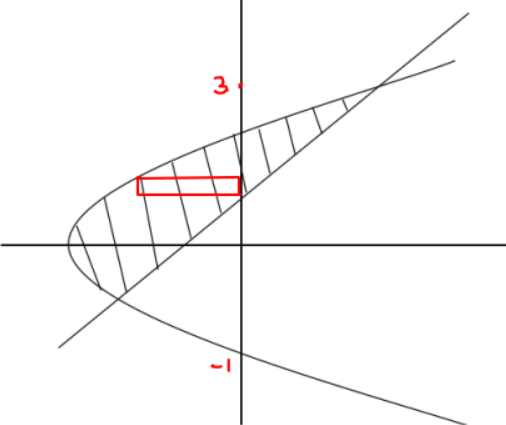
$$
\begin{aligned}
y^2 = x + 4 &\rarr x = y^2 - 4 \\
y = {1 \over 2}x + {1 \over 2} &\rarr x = 2y - 1 \\
\\
y^2 - 4 &= 2y - 1 \\
y^2 - 2y - 3 &= 0 \\
(y - 3)(y + 1) &= 0 \\
y_1 = 3 & ,\ y_2 = 01 \\
\\
Area &= \int_{y=-1}^3 (2y - 1) - (y^2 - 4) \ dy \\
	&= \int_{y=-1}^3 -y^2 + 2y + 3 \ dy \\
	&= \left. \lbrack {-{y^3 \over 3} + {2y^2 \over 2} + 3y} \right|_{-1}^3 \\
	&= -{27 \over 3} + 9 + 9 - (-{-1 \over 3} + 1 - 3) \\
	&= {32 \over 3}
\end{aligned}
$$
